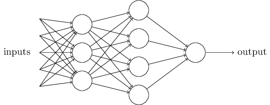
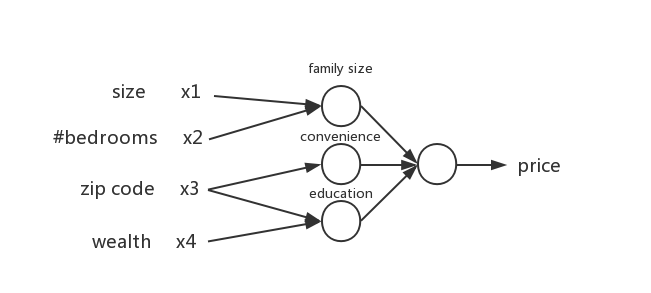

# 神经网络

神经网络是机器学习的底层模型，为了通俗解释它，先从人类的神经网络说起。

我们知道，我们的大脑在收到外界刺激的时候产生电信号，不同神经元发出电信号最汇聚到神经中枢，最后神经中枢依据这些信号做出决策。

---

## 从一个例子说起

你放学回家看见一个大汉向你走来，你的脑子里过了这些东西：

1. 他今天对我说过“放学别走”
2. 我肯定打不过他
3. 我跑得比较快

综合以上信息，你的大脑得出了 “跑” 的结论。

用一张图来表示：

x1, x2, x3 便是你上述所想的种种，最后通过权衡决策，输出的 y 便是最后 “跑” 的结论。

---

## 多层次神经网络

上述神经网络属于最简单的类型，而实际的神经网络往往更加复杂，很多中间层，最后产生结果。

下面利用房价预测的例子来解释多层神经网络。

假设你拥有一个房子的以下信息，想要估计一下这个房子最终能卖多少钱。

1. 房子大小
2. 房间个数
3. 所在街道
4. 周围学校

我们发现：

* 1 和 2 共同决定了你这个房子的结构以及舒适度
* 3 决定了你外出的便利程度
* 3 和 4 共同决定了孩子未来所受教育的质量

