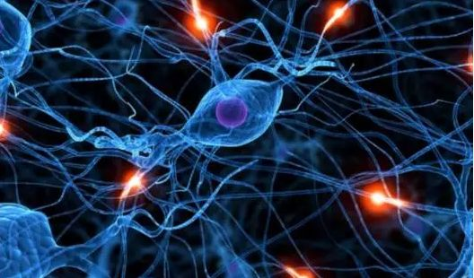

# 神经网络

神经网络是机器学习的底层模型，为了通俗解释它，先举一个例子。

---

## 决策过程

你放学回家看见一个大汉向你走来，你的脑子里过了这些东西：

1. 他今天对我说过“放学别走”
2. 我肯定打不过他
3. 我跑得比较快

综合以上信息，你的大脑得出了 “跑” 的结论。

用一张图来表示：

x1, x2, x3 便是你脑子闪过的种种想法，最后通过权衡决策，输出的 y 便是最后 “跑” 的结论。当然，这图在机器学习领域有一个专有名词：**感知器 (Perceptron)**

一个感知器接受多个输入（x1，x2，x3...），产生一个输出（output），好比神经末梢感受各种外部环境的变化，最后产生电信号。

---

## 多层次神经网络

单个的感知器构成了一个简单的决策模型，已经可以拿来用了。真实世界中，实际的决策模型则要复杂得多，是由多个感知器组成的多层神经网络。

---

下面利用房价预测的例子来解释多层神经网络。

假设你拥有一个房子的以下信息，想要估计一下这个房子最终能卖多少钱。

1. 房子大小
2. 房间个数
3. 所在街道
4. 周围学校

我们发现：

* 1 和 2 共同决定了你这个房子的结构以及舒适度
* 3 决定了你外出的便利程度
* 3 和 4 共同决定了孩子未来所受教育的质量

于是，再根据房屋结构，舒适度，便利程度和教育质量，对房屋的价格做出一个评估。

---

## 人类神经元

其实，多层次神经网络模型就是人类大脑的抽象。多个电信号从树突传入神经元，神经元进行分析后产生一个电信号通过轴突输出，再传递到下一个神经元，最终做出决策。

最终，无数的神经元互相连接，信号相互以这种方式传递，便构成了我们复杂的神经系统，让我们能够学习，记忆，感知这个世界。

