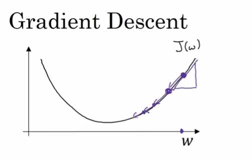

# Gradient Descent ( 梯度下降 )

在之前的Logistic Regression 中，我们得到了整体的 Cost Function：

 \\\\= \frac {1}{m}\sum_{i=1}^{m}L(y_p^{(i)}, y^{(i)})
\\= -\frac {1}{m}\sum_{i=1}^{m}(y^{(i)}\log y_p^{(i)} + (1-y^{(i)})\log (1 - y_p^{(i)}))
$$)

而我们要做的，就是最小化这个Cost Function。

---

## 算法原理

最简单的一个参数的例子说起

我们可以利用如下的公式：

}{d \omega}
$$)

* **当 &omega; < 局部最优解的时候，导数 < 0，迭代让 &omega; 增大**
* **当 &omega; > 局部最优解的时候，导数 > 0，迭代让 &omega; 减小**

 

推广到多参数类型，&omega; 为 n 维向量，b 为 实数，则：

}{\partial \omega}
$$)

}{\partial b}
$$)

---

## Logistic Regression 迭代公式

刚好闲来无事，决定自己推一发这个公式，就当复习一下高数。

### 推导：

其中最重要的便是求出：

 

设x(i)为2维向量：

 

 

 

微积分常识得到：

**依靠这个式子，下面开始逐步化简**。

---

#### 第一项：

 

为了方便起见，先省略前面的求和符号,结尾处补上。

---

#### 第二项：

 

---

#### 第一项 × 第二项：

---

#### 第三项：

----

#### 补上求和符号，整体化简：

 

**我们注意到，还可以化简为**：

 

---

### 结论：

得到 Logistic Regression 的 Gradient descent公式：

} - y^{(i)})x^{(i)}
$$)

---

## 算法实现：

我们假设输入的训练样本 **X** 为 n * m 维矩阵，n 为feature 个数，m 为样例数。其中的 x(1), x(2) ... 都是 n 维向量

} & x^{(2)} &  \dots & x^{(m)} \\
 \vdots & \vdots & \vdots & \vdots
\end{matrix}
\right]
$$)

初始化参数 n维向量 &omega;；实数 b

### Step 1

 + b 
$$)

---

### Step 2

\\\\$$)

 

}{\partial \omega} 
= \frac{1}{m} ( X · (\hat{y} - y)^T)\\\\$$)

}{\partial b}
= \frac{1}{m} (sum(\hat{y} - y))
$$)

### Step 3

}{\partial \omega}
$$)

}{\partial b}
$$)

重复上述迭代。