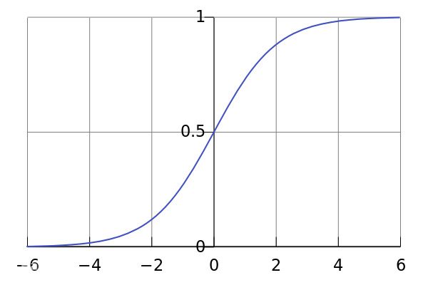

# 从二元分类问题谈起

现在，你是一个医生。病人拿着自己核磁共振的片子过来找你，因为他的体内有一颗肿瘤，而他想知道的，是这颗肿瘤是良性的还是恶性的。

通过片子，你可以判断肿瘤的生长部位和肿瘤大小，你需要依据这两个条件来判断这颗肿瘤是：

* 0 良性
* 1 恶性

---

以上便是二元分类问题，而上述的“生长部位”和“肿瘤大小”称之为 **特征 (feature)**。

专业点的说法：已知训练样本是个 n 维向量，即 n 个 feature 组成的向量，输出的结果只有两种，用 1 / 0 表示，这就是二元分类问题。

例如上述的给定肿瘤生长部位和大小判断是否恶性；又或者是给定64 * 64图片每个像素的 RGB 值，也就是一个 64 * 64 * 3 维的向量作为输入，判断这张图片是不是一只猫的图片。

---

## Logistic Regression

**数据训练集：**

n维向量x：

$$
x = 
\left[
\begin{matrix}
 x1     \\
 x2    \\
 \vdots \\
 xn     \\
\end{matrix}
\right]
$$

当然，只有输入的 **x** 还不够，因为你需要综合 **x** 的每一项来得出结论，因此在综合这些 **feature** 的时候，我们需要给向量 **x** 的每一项都乘上相应的权值。

因此，我们假设 参数 **&omega;**, 同样为 n 维向量，作为 x 每一项的权值，另外还有偏移参数 **b**，计算出预测的结果 **z**

$$
z = \omega^T· x + b
$$

---

这时候我们发现问题：z 可以是一个很大或者很小的数，但我要的是 0 和 1 啊，你给我计算出一个 12138 我怎么预测？

因此，我们引入 Logistic 函数，这个函数的值域 为 (-1, 1) ,只需要把刚才的计算结果 z 经过这个函数，就可以预测 0 / 1了，我们将最终的预测值设为 **ŷ**。

表达式：

$$
\sigma(z)=\frac{1}{1 + e^{-z}}
$$

因此设置预测的值 **ŷ** 会严格在0和1之间

---

### Loss Function

所谓 Loss Function，指的就是你的预测值与正确值的偏差程度。做一个简单的类比，你的神经网络给出的预测值 **ŷ** 就像考试的时候你写在卷面的答案，而 **y** 是考试的标准答案。我们则希望“偏差”越小越好，即 Loss Function 越小越好。

Loss Function 用以下方法计算：

$$
L(\hat{y}, y) = -(y\log \hat{y} + (1-y)\log (1 - \hat{y}))
$$

---

#### 当 y = 1 时：

$$L(\hat{y}, y) = - \log \hat{y}$$

我们希望Loss function 小，因为 0 < ŷ < 1 所以 log ŷ < 0, - log ŷ > 0 且 ŷ -> 1，- log ŷ 越接近 0，所以此时 **ŷ 越接近 1 越好**

---

#### 当 y = 0 时：

$$L(\hat{y}, y) = - \log (1 - \hat{y})$$

同样希望Loss function 小，1 - ŷ 越大越好，所以此时 **ŷ 越接近 0 越好**

---

### Cost Function

Cost Function 为所有参与训练的 m 个样例中，所有 Loss Function 的算术平均：

$$
\begin{aligned}
J(\omega, b) & = \frac {1}{m}\sum_{i=1}^{m}L(\hat{y}^{(i)}, y^{(i)}) \\
&= -\frac{1}{m}\sum_{i=1}^{m}(y^{(i)}\log \hat{y}^{(i)} + (1-y^{(i)})\log (1 - \hat{y}^{(i)}))
\end{aligned}
$$