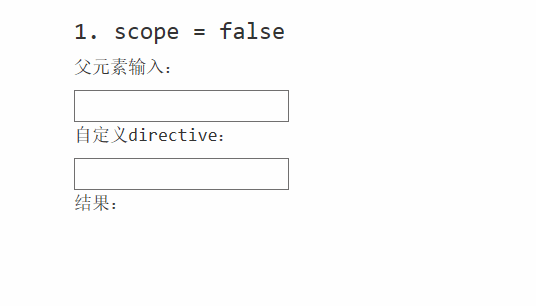
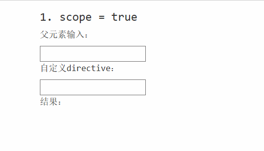
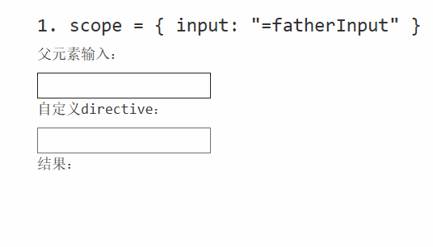
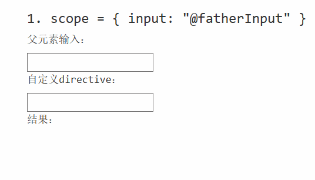

# 自定义组件 Directive

---

## 1. Basic

Directive 允许我们创建自己的html Tag，可使用字符串或者是html文件作为模板，**Runs during compile**.

**app.js**:

```js
app.directive("listItemDescription", function () {
    var ddo = {
        template: "{ { item.name } }: { { item.cost | currency : '$' : 2 } }"
    };

    return ddo;
});

/*Or html template file*/
app.directive("listItem", function () {
    var ddo = {
        templateUrl: "listItem.html"
    };
    return ddo;
});
```

**listItem.html**:

```html
<li>
    <list-item-description></list-item-description>
</li>
```

**index.html**

```html
<ul>
    <list-item ng-repeat="item in list.items"></list-item>
</ul>
```

---

## 2. Restrict

* **restrict: "AE"**: 可以用作 element 或者 attribute
* **restrict: "E"**: 只可以用作 element
* **restrict: "A"**: 只可以用作 attribute

**app.js**

```js
app.directive('myDirective', function () {
    var ddo = {
        restrict: "AE",
        templateUrl: "template.html",
    };

    return ddo;
});
```

```html
<!-- Element -->
<my-directive></my-directive>

<!-- Attribute -->
<div my-directive></div>

```

---

## 3. scope

**index.html**

```html
<body ng-app="MainApp">
    <div class="container">
        <div ng-controller="ctrl">
            <p>父元素输入：</p>
            <input ng-model="input" type="text" />
            <dir-input></dir-input>
        </div>
    </div>
</body>
```

**app.js**

```js
app.directive('dirInput', function () {
    var ddo = {
        restrict: "E",
        templateUrl: "template.html",
        scope: false //default
    };

    return ddo;
});
```

**template.html**

```html
<div>
    <p>自定义directive：</p>
    <input type="text" ng-model="input" />
    
    <p>结果：{ { input } }</p>
</div>
```

---

### (1) scope: **false**

当 directive 中的 scope 为默认值 **"false"** 时，直接使用父元素里的scope。



---

### (2) scope: **true**

```js
app.directive('dirInput', function () {
    var ddo = {
        restrict: "E",
        templateUrl: "template.html",
        scope: true //change
    };

    return ddo;
});
```

当 directive 中的 scope 为 **true** 时，一开始是绑定在父scope中，但当修改位于自定义指令中的输入框时，子scope就被创建并继承父scope了。之后，修改父scope并不能影响input的值。



---

### (3) scope: **{ }**

创建隔离scope，directive 将无法访问到父scope，传递数据时有两种绑定方式： 

* **=**: 双向绑定
* **@**: 单向绑定

---

**双向绑定 "="**：

**app.js**

```js
app.directive('dirInput', function () {
    var ddo = {
        restrict: "E",
        templateUrl: "template.html",
        scope: {
            input: "=fatherInput" // directive 中的 "input" 双向绑定传给他的 father-input
        }
    };

    return ddo;
});
```

**index.html**

```html
<body ng-app="MainApp">
    <div class="container">
        <div ng-controller="ctrl">
            <p>父元素输入：</p>
            <input ng-model="input" type="text" />
            <dir-input father-input="input"></dir-input>
        </div>
    </div>
</body>
```



---

**单向绑定 "@"**：

**app.js**

```js
app.directive('dirInput', function () {
    var ddo = {
        restrict: "E",
        templateUrl: "template.html",
        scope: {
            input: "@fatherInput" // directive 中的 "input" 双向绑定传给他的 father-input
        }
    };

    return ddo;
});
```

注意，与 "=" 绑定不同的是，"@" 绑定只会绑定的是字面字符串而不是model对象，因此是单向的。html中绑定元素应该这样写：

```html
<body ng-app="MainApp">
    <div class="container">
        <div ng-controller="ctrl">
            <p>父元素输入：</p>
            <input ng-model="input" type="text" />
            <dir-input father-input="{ { input } }"></dir-input>
        </div>
    </div>
</body>
```



---

## 4. Directive controller 和 scope 函数传递 "&"：


**app.js**

```js
app.controller("Controller", function () {
    var parentCtrl = this;
    
    parentCtrl.parentMethod = function (arg1) {
        //do something...
    };
});

app.directive('myDirective', function () {
    var ddo = {
        restrict: "E",
        templateUrl: "template.html",
        scope: {
            /*directive 中的 dirCtrl.dirMethod() 方法通过上层 dir-method="someMethod();" 传入*/
            dirMethod: "&" 
        },
        controller: directiveController,
        bindToController: true,
        controllerAs: "dirCtrl"
    };

    return ddo;
});
```

**index.html**

```html
<div ng-controller="Controller as parentCtrl">
    <my-directive dir-method="parentCtrl.parentMethod(arg);"></my-directive>
</div>
```

**template.html**

```html
<button ng-click="dirCtrl.dirMethod({arg : 0});"></button>
```

注意：两个html中的arg需一样，在template中传入值


---

## 5. Directive link

Directive 中的 **link** 可以用来操作 **DOM** 元素。

声明如下：

```js
var directiveLink = function (scope, element, attrs, controller) {
    /*
     * scope 和 $scope 一样，区别在于没有依赖注入
     * element 是所有元素，可以用element.find("div") 找到，如果先导入了jquery，拥有jquery方法
     */
};

app.directive('myDirective', function () {
    var ddo = {
        restrict: "E",
        templateUrl: "template.html",
        scope: {
            dirMethod: "&" 
        },
        controller: directiveController,
        bindToController: true,
        controllerAs: "dirCtrl",

        link: directiveLink //link
    };

    return ddo;
});
```

---

## 6. Directive transclude

将ddo中的transclude 属性设置为 **true**，则可以在父html中向指令添加东西。

```js
app.directive('myDirective', function () {
    var ddo = {
        restrict: "E",
        templateUrl: "template.html",
        controller: directiveController,
        bindToController: true,
        controllerAs: "dirCtrl",

        transclude: true //Here
    };

    return ddo;
});
```

**index.html**

```html
<div ng-controller="ParentController as parentCtrl">
    <my-directive>
        { { parentCtrl.prop } }
    </my-directive>
</div>

```

**template.html**

```html
<div>
    { { dirCtrl.prop } }
</div>
<div ng-transclude>
    <!-- { { parentCtrl.prop } } inject here -->
</div>
```
