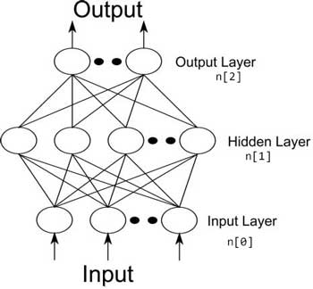

# 一个 Hidden Layer 的 Neural Network 算法实现 ( Gradient Descent )

设：

* 输入 **x** feature 数目为 n[0]
* hidden layer 节点数为 n[1]
* 输出节点数为 n[2]
* Activation Function 为 g(z)

---

## Parameters

* **w1**: ( n[1] , n[0] )

* **b1**: ( n[1] , 1 )

* **w2**: ( n[2] , n[1] )

* **b2**: ( n[2] , 1 )

---

## Forward Propagation

输入数据 **X** ( n[0], m ) 通过神经网络计算 **ŷ**

$$
\begin{aligned}
&A^{[0]} = X\\
&Z^{[1]} = w_1 \cdot A^{[0]} + b_1\\
&A^{[1]} = g_{1}(Z^{[1]})
\end{aligned}
$$

逐层计算即可：

$$
\begin{aligned}
&Z^{[2]} = w_2 \cdot A^{[1]} + b_2\\
&A^{[2]} = g_{2}(Z^{[2]})\\
&\hat{Y} = A^{[2]}
\end{aligned}
$$

---

## Backward Propagation

### Cost Function

$$
J = \frac{1}{m} \sum_{i = 1}^{m}L(\hat{y}, y)
$$

---

### Gradient Descent

$$
\begin{aligned}
&dw_1 = \frac{\partial J}{\partial w_1}\\\\ 
&w_1 := w_1 - \alpha \cdot  dw_1
\end{aligned}
$$

其它参数同理

---

### 实现

$$
\begin{aligned}
&dZ^{[2]} = \hat{Y} - Y = A^{[2]} - Y & ( n_{[2]} \times m)\\\\
&dw_2 = \frac{1}{m} dZ^{[2]} \cdot A^{[1]T} & ( n_{[2]} \times  n_{[1]} )\\\\
&db_2 = \frac{1}{m} np.sum(dZ^{[2]}, axis = 1) &(n_{[2]} \times 1)
\end{aligned}
$$

---

$$
\begin{aligned}
&dZ^{[1]} = {w_2}^T \cdot dZ^{[2]} \times {g_1}^{\prime}(Z^{[1]}) & (n_{[1]} \times m)\\\\
&dw_1 = \frac{1}{m} dZ^{[1]} \times {A_0}^T & (n_{[1]} \times n_{[0]})\\\\
&db_1 = \frac{1}{m} np.sum(dZ^{[1]}, axis = 1) & (n_{[1]} \times 1)
\end{aligned}
$$