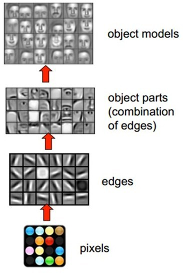
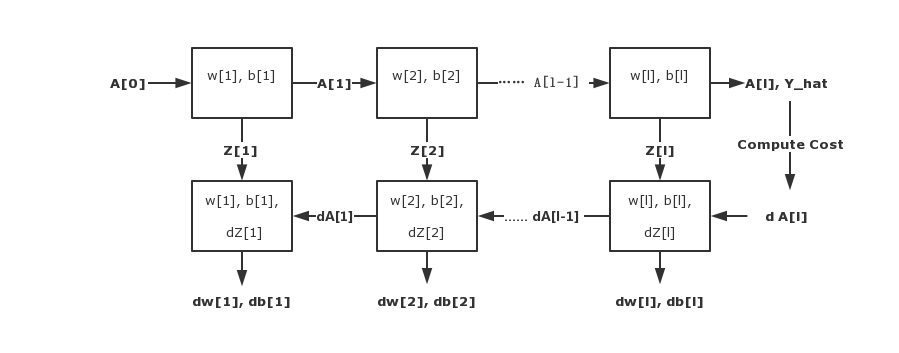

# 深度神经网络

## Why deep representations?

在使用深度神经网络之前，我们想要知道，为什么我们想要让自己的 Neural Network 变得更深？

以 **CNN**（卷积神经网络）为例，CNN主要用于图像的识别，下图展现了在人脸识别中经过层层的卷积后，所能够探测的形状、概念也变得越来越抽象和复杂。

* **Layer 1**: 能够识别图像中的**边缘信息（Edge）**
* **Layer 2**: 能够通过 Layer 1 的信息继续识别图像中的**五官信息**
* **Layer 3**: 能够通过 Layer 2 的信息继续抽象识别**面部**

当然，这只是粗略描述，更多关于 CNN 的信息可以参见这篇文章：[卷积神经网络——介绍](https://zhuanlan.zhihu.com/p/27642620)

---

## Implement

对于 Deep Neural Network 来说，实现它主要分为两个大步骤：

1. Forward Propagation
2. Backward Propagation

以 **Layer l** 为例:

&nbsp; | Input | Output
----|------|----
Forward | A[ l - 1 ] | A[ l ]
Backward | dA[ l ] ( cache Z[ l ] )  | dA[ l - 1 ] ( dW[ l ] , db[ l ] )

---

整个计算过程可以用以下流程图概括：

---

## Algorithm

### Forward

**Input**: A [ l - 1 ]

$$
\begin{aligned}
Z^{[l]} & = W^{[l]} \cdot A^{[l - 1]}\\\\
A^{[l]} &= g^{[l]}(Z^{[l]})
\end{aligned}
$$

**Cache**: Z [ l ]

**Output**: A [ l ]

---

### Backward

首次输入的 dA [ l ] 为：

$$\begin{aligned}
& dA^{[l]} = - \frac{Y}{A^{[l]}} + \frac{1 - Y}{1 - A^{[l]}}\\\\&(Tips: A^{[l]} = \hat{Y})
\end{aligned}$$

---

**Input**: dA [ l ]

$$
\begin{aligned}
dZ^{[l]} &= dA^{[l]} \times {g^{[l]}}^{\prime}(Z^{[l]})\\\\
dW^{[l]} &= \frac{1}{m} dZ^{[l]} \cdot {A^{[l - 1]}}^{T} \\\\
db^{[l]} &= \frac{1}{m} np.sum(dZ^{[l]}, axis = 1, keepdims = True) \\\\
dA^{[l-1]} &= {W^{[l]}}^{T} \cdot dZ^{[l]}
\end{aligned}
$$

**Output**: dA [ l - 1 ], dW [ l ], db [ l ]
