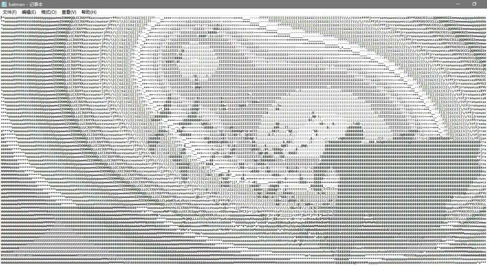

# Python 图像处理库 Pillow 的使用

**Pillow** 是 Python 的一个图像处理库：Python Image Library ( PIL )


## Installation

使用 **pip** 安装

```
python -m pip install pillow
```

---

## Quick Start

```py
#1. 导入模块
from PIL import Image

#2. 读取图片
img = Image.open('test.jpg')

#3. 保存文件
img.save(filename, format)
#E.g.
img.save(filename,"JPEG")

#4. 获取图片大小
(width, height) = img.size

#5. 获取图片的源格式
img_format = img.format

#6. 获取图片模式，有三种模式：L(灰度图像)，RGB(真彩色)和CMYK(pre-press图像)
img_mode = img.mode

#7. 图片模式的转换
img = img.convert("L")  #转化成灰度图像

#8. 获取每个坐标的像素点的RGB值
r,g,b = img.getpixel((j,i))

#9. 重设图片大小
img = img.resize(width,height)

#10. 创建缩略图
img.thumbnail(size)

#11. 显示图片
img.show()

#12. 提取色彩通道灰度图
r, g, b = img.split()
img = Image.merge("RGB", r, g, b)
```

---

## Example

使用 PIL 将一张图片转为字符画

代码：

```py
from PIL import Image

def image_transfer(image_addr, file_name, out_size):
    """
    :param image_addr: image address
    :param file_name: name of output file (e.g. test.txt)
    :param out_size: size of output file
    """

    #设置不同灰度值对应的 ASCII 字符
    ascii_char = list("$@B%8&WM#*oahkbdpqwmZO0QLCJUYXzcvunxrjft/\|()1{}[]?-_+~<>i!lI;:,\"^`'. ")
    
    #打开图片文件并 resize
    img = Image.open(image_addr)
    img = img.resize(out_size)

    #调用convert, 得到写入 txt 的字符串
    txt = convert(img, ascii_char)

    f = open(file_name,"w")
    f.write(txt)
    f.close()

def convert(img, ascii_char):
    #转换成灰度图片
    img = img.convert("L")
    txt = ""

    ascii_length = len(ascii_char)

    for i in range(img.size[1]):
        for j in range(img.size[0]):
            #获取每个pixel的灰度值
            gray = img.getpixel((j, i))
            #将灰度值转化为字符
            txt += ascii_char[int((gray / 256.0) * ascii_length)]
        txt += '\n'
    return  txt

# Run
image_transfer("./batman.jpg", "./batman.txt", (265, 70))
```

---

效果：

**batman.jpg**


**batman.txt**

