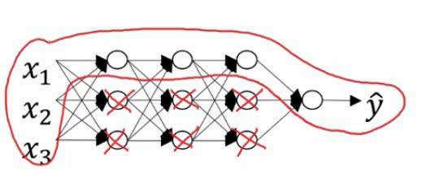
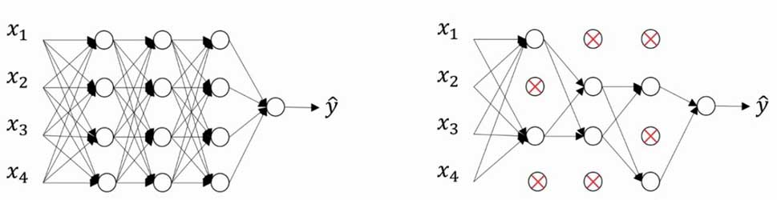

# 偏差 / 方差问题与正则化

在机器学习中，我们需要把数据集划分为：

1. **Training Set**: 训练集，用于训练数据
2. **Dev Set**: 交叉验证集，用于评估不同算法
3. **Test Set**: 测试集，用于测试算法表现

而在使用 Dev Set 评估算法的过程中，我们经常会发现以下几种问题，也就是 **偏差 ( Bias )**, **方差 ( Variance )** 问题。

---

## 高偏差 ( High Bias )

### 表现：

对于 Training Set 的拟合度很低，同样必然导致对在交叉验证时表现很差。如下图：


### 对策：

使用更大规模，更多隐藏单元的神经网络进行训练。

---

## 高方差 ( High Variance )

### 表现：

对于 Training Set 高度拟合，正确率非常高，但是对于 Dev Set 拟合度很低，则数据出现了过拟合，如下图：


### 对策：

1. 搜集更多的数据进行训练
2. 正则化 ( Regularization )

---

## 正则化 ( Regularization )

### L2 范数正则化

Logistic Regression Cost Function 计算变为：

$$
\begin{aligned}
&J(w, b) = \frac{1}{m} \sum_{i=1}^{m}L(\hat{y}^{(i)}, y^{(i)}) + \frac{\lambda}{2m}||w||_2^2 \\\\
&||w||_2^2 = \sum_{j = 1}^{n_x}w_j^2 = w^T \cdot w
\end{aligned}
$$ 

其中 **&lambda;** 称作正则化参数。

当然，也存在 L1 正则化，此时结尾需要加上 **w** 各项绝对值之和，也就是 \|\|w\|\|1，这会出现 w 稀疏化的现象，因此不常使用。

---

### Frobenius 范数正则化

Neural Network Cost Function 计算变为：

$$
\begin{aligned}
& J(w, b) = \frac{1}{m} \sum_{i=1}^{m}L(\hat{y}^{(i)}, y^{(i)})
+ \frac{\lambda}{2m} \sum_{l=1}^{L}{||w||}^2_F\\\\
& {||w||}^2_F = \sum_{i = 1}^{n[l]}\sum_{j = 1}^{n[l-1]}(w_{ij})^2
\end{aligned}
$$

迭代公式变为：

$$
\begin{aligned}
& dw = (backprop) + \frac{\lambda }{m} w\\\\
& w := w - \alpha dw\\\\
& w:= (1 - \frac{\alpha \lambda}{m}) w - \alpha (backprop)
\end{aligned}
$$

---


### 原理

因为此时神经网络的 Cost Function 计算公式为：

$$
J(w, b) = \frac{1}{m} \sum_{i=1}^{m}L(\hat{y}^{(i)}, y^{(i)})
+ \frac{\lambda}{2m} \sum_{l=1}^{L}{||w||}^2_F
$$

我们增大 **&lambda;** 的值，为了使 Cost Function 变小， **w** 矩阵也会变小甚至接近于 0，则整个神经网络中，那些接近 0 的单元影响就会变小，整个神经网络相当于变得更加简单，因此更难出现过拟合问题。



---

另一方面，以 **tanh** 函数为例，函数曲线如图：


我们看到，tanh 函数在中间部分接近于线性。如果正则化使得 w 减小， z = w · z + b 也将减小，tanh(z) 的计算也将**接近线性函数**。

如果神经网络各层都接近线性，则神经网络的多层将没有意义，这也能解释为什么正则化可以防止过拟合。

---

### Dropout Regularization ( 随机失活正则化 ) 

Dropout 是指按一定概率随机让每一层的某些节点失活，从而降低网络规模，主要应用在计算机视觉方面，如下图：



#### 算法实现

```py
# 以 layer3 为例, a3 为 layer3 计算出的所有节点
keep_prop = 0.8

d3 = np.random.rand(a3.shape[0], a3.shape[1]) < keep_prop

# Forward Prop
a3 = np.multiply(a3, d3)

# 保持 a3 期望不变
a3 /= keep_prop


# Backward Prop
da3 = np.multiply(da3, d3)

# 同样保持 da3 期望不变
da3 /= keep_prop

```

注：在 Test 阶段不应用 Dropout.

---

#### keep_prop 的选取

根据不同 Layer 的矩阵规模，通过规模越大的矩阵计算出的节点一般对应更小的 keep_prop；对于一些没有必要担心过拟合的层，可以将 keep_prop 的值设置为 1，表示该层不需要 Dropout。