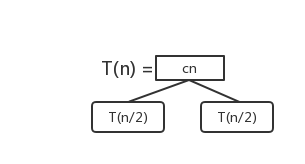
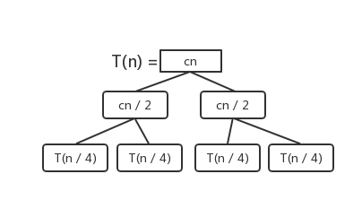
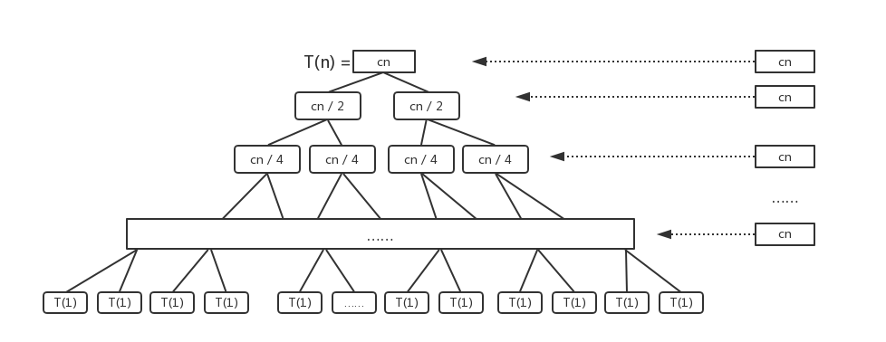

# Recursion Tree

在使用**分治法( Divide and Conquer )** 来求解问题的过程中不可避免会用到**递归( Recursion )**，这给算法的复杂度分析带来了麻烦，使用归并排序 ( Merge Sort ) 进行说明。

---

## Merge Sort

主函数代码如下：

```py
def merge_sort(nums):
    n = len(nums)
    if n < 2:
        return
    else:
        nums_left = mergeSort(nums[0 : n / 2])
        nums_right = mergeSort(nums[n / 2 : n])
        merge(numsLeft, numsRight)
```

---

## Merge Sort 复杂度分析

* 设原问题的复杂度为 **T(n)**

* Merge 左右两个顺序序列复杂度为 **O(n)**


则：

$$
T(n) = \begin{cases} 
        O(1) & if (n <= 1)\\
        2T(n / 2) + O(n) & if (n > 1)
\end{cases}
$$

---

## 递归树

### 建立递归树

我们设完成所有任务所需要的总步骤为 **T(n) = 2 * T(n / 2) + cn**:

显然，我们把最后一次 Merge 数据的步骤数设为 cn.

---

根据上述递推式建立递归树：



表示我们需要的总步骤为整个树的节点之和，即  **T(n) = cn + 2 * T(n / 2)**

---

而： **T(n / 2) = (cn / 2) + 2 * T(n / 4)**，所以我们继续补全递归树：



---

按照这个规则，最后到达最底部，整棵递归树完成：



---

### 分析递归树

观察整个递归树，发现以下信息：

* 这颗递归树叶节点就是全部待排序的数字，为 **n**，最底层计算量为 **O(n)**。
* 递归树的高度为 **log(n)**
* 每层的计算量均为 **cn**

---

### 结论

可以计算 **T(n) = log(n) * cn + O(n)**

因为 **cn = O(n)**

因此:

$$
T(n) = O(nlogn + n) = O(nlogn)
$$

所以 Merge Sort 复杂度为 **O(nlogn)**

---

同样的，如果递归式为 **T(n) = 4T(n / 2) + O(n)** 我们也可以利用递归树分析出 *（式子中的相等指渐进意义下）*:

$$
\begin{aligned}
T(n) & = cn + 4 \times \frac{cn}{2} + 16 \times \frac{cn}{4} + ... + 4^{logn}\times\frac{cn}{2^{logn}}\\\\
& = cn + 2cn + 4cn + 8cn + ... + ncn
\end{aligned}
$$

因此，该算法复杂度为 **O(n^2)**