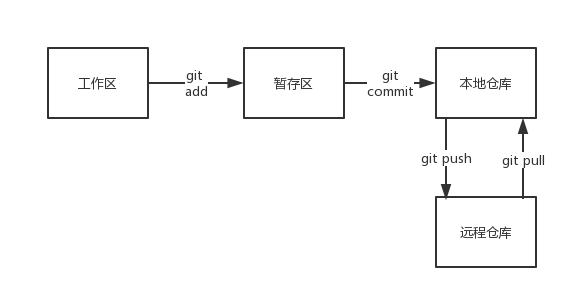

# Git 初探：git add & git commit 以及基本概念

## 写在前面

此前一直想要写一系列小白友好的 git 博客，但因为时间和自身能力原因一直被搁置，现在决定占个坑慢慢更新。因为很多都是自己的理解，所以不敢保证一定是严谨正确的啦。

---

## 什么是 Git / Github

> Git 是 Linus 为了更好地管理 Linux 内核开发而创立的分布式版本控制／软件配置管理软件。

这……每个字都认识，就是看不太懂，一定是打开方式不太对，那么我们换一种打开方式，从头开始：

* 你是否曾经手闲改了改自己的代码，结果居然无法运行，而且改不回去？

* 你是否因为换了一台电脑没法打代码而感到失去人生方向？

* 你是否在跟队友合作打项目的时候还在用 U 盘合并你们的代码？

如果以上答案有任意一个为 **“Yes”**，那么 Git 或 Github 就能帮到你。

---

简单定义一下：

* **Git 可以理解为在你本地管理并保存你代码的历史版本的工具**

* **Github 是个提供了 Git 托管服务的网站，可以把本地仓库扔到网上去**

---

## Git 仓库

Git 仓库主要分为计算机本地的**本地仓库**和网络上的**远程仓库**。

### 一、本地仓库

#### 工作区与暂存区

我们想象生活中场景：

* 工人在工厂生产出**产品**

* 生产出的产品被运到指定的**仓库门前**

* 等到仓库前已经有了预期数量的产品，将它们标号记录后后进入仓库保存

---

现在，你的本地 git 仓库就是上述的产品仓库，把代码想象成**产品**。

你早上写了些代码，你想把它堆在仓库门前（**存入暂存区**），因为下午还要改，所以暂时不装入仓库（大家都希望仓库里是合格的产品）。

你下午完成了剩下的代码，你把他们也堆在了仓库门前（**再存入暂存区**）。

你现在的代码已完善的不错，你觉得可以装入仓库，于是你将其记录然后提交进入代码仓库（**commit**）。

---

**工作区**：你写代码的本地环境，保存着你当下所写的任意代码。

**暂存区**：你有意的把一些完成的代码存入暂存区，可以随时把工作区的代码添加到暂存区，表示随时可以准备提交进入本地仓库。

---


先用一张图概括下文要讲的命令：



---

#### 1. git add 命令

**git add {filename}**: 将工作区的名为 filename 的文件添加到暂存区，如：

```
git add helloworld.c  //添加单个文件
git add floder        //添加整个floder文件夹里的文件
git add .             //添加当前目录的所有文件 and 文件夹
```

---

#### 2. git commit 命令

**git commit -m "some words"**: 将暂存区的所有文件提交到本地仓库，并添加一条记录，如：

```
git commit -m "fix bug #5"
```

利用 commit, git 可以记录你的代码的所有版本，并在你需要的时候进行回滚。

---

### 二、远程仓库

任意提供了 git 托管服务的服务器都可以作为 git 的远程仓库，而 GitHub 就是其中之一。


#### 3. git push 命令

将本地仓库的信息同步到远程仓库中。

```
git push               //将本地代码上传到远程对应分支上，后面会详解
git push origin master //将本地代码上传到远程的 master 分支
```

在只有一个 master 分支的情况下，这两个命令没有区别。

---

#### 4. git pull 命令

因为有了 git push 命令，对应的也就有了 git pull 命令，将远程仓库的改动同步到本地。

```
git pull               //将远程对应分支的代码同步到本地
git pull origin master //将远程master分支代码同步到本地
```

---

下一篇：[Git 使用手册（二）：Git 分支管理](/git/branch)