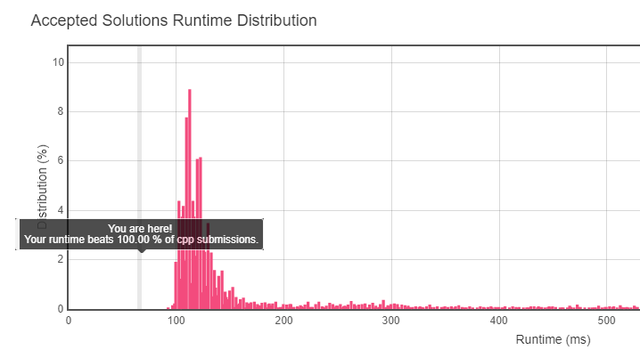

# Problem Set #2

记录第二周 (2017/09/11 - 2017/09/17) 完成的题目。

---

## #15. 3Sum

Difficulty: Medium

**问题描述**：

Given an array S of n integers, are there elements a, b, c in S such that a + b + c = 0? Find all unique triplets in the array which gives the sum of zero.

Note: The solution set must not contain duplicate triplets.

For example: 

given array **S = [-1, 0, 1, 2, -1, -4]**,

A solution set is: **[ [-1, 0, 1], [-1, -1, 2] ]**

**分析**：

这道题以前接触过，因此还是能想到方法的。朴素解法就是三重循环分别相加看看和是否为 0 ，然而复杂度达到了 **O(n^3)**。因此必须采用新的方法。

算法：首先对数据进行排序。假设有三个指针 first, second, third，分别指向第一个，first 后一个和最后一个排序后的元素。固定 first，计算三个指针指向的数字的和 sum，有以下几种情况：

1. **sum < 0**：偏小，需要寻找更大的，因为first固定，所以我们让 second++。
2. **sum > 0**：偏大，需要寻找更小的，让 third--。
3. **sum == 0**：找出一个解，同时让 second++, third--。为了去重复，所以如果新的 second 和之前一样则直接跳过，third 亦然。

进行一趟扫描后，增加 first 的值，如果 first 值和之前一样则没有必要重复计算，直接自增即可。


采用上述算法，复杂度可以降到 **O(n^2)**，顺利 AC。

**实现**：

C++ 实现：

```cpp
class Solution {
public:
    vector<vector<int>> threeSum(vector<int>& nums) {
        vector<vector<int>> ans; //#include <vector>
        if (nums.size() < 3) {
            return ans;
        }
        vector<int> ansTemp;
        sort(nums.begin(), nums.end());  //#include <algorithm>
        
        int first = 0;
        while (first < nums.size() - 2) {
            ansTemp.push_back(nums[first]);
            int second = first + 1, third = nums.size() - 1;
            while (second < third) {
                int sum = nums[first] + nums[second] + nums[third];
                if (sum < 0) {
                    ++second;
                } else if (sum > 0) {
                    --third;
                } else {
                    ansTemp.push_back(nums[second]);
                    ansTemp.push_back(nums[third]);
                    ans.push_back(ansTemp);
                    while (second < third && nums[++second] == ansTemp[1]);
                    while (second < third && nums[--third] == ansTemp[2]);
                    ansTemp.pop_back();
                    ansTemp.pop_back();
                }
            }
            ansTemp.pop_back();
            while (first < nums.size() - 2 && nums[first] == nums[++first]);
        }
        return ans;
    }
};
```

小炫耀一下（虽然不知道为啥会这样）：



---

## #8. String to Integer (atoi)

Difficulty: Medium

**问题描述**：

Implement atoi to convert a string to an integer.

**Hint**: Carefully consider all possible input cases. If you want a challenge, please do not see below and ask yourself what are the possible input cases.

**分析**：

题目本身不难，但是通过测试样例发现了以下几个坑：

* 首位可以是正负号
* 开头可以有任意多的 Space ' '
* 计算到第一个非数字字符为止
* 烦人的 Overflow 问题

**实现**：

C 语言实现：

```c
int myAtoi(char* str) {
    int n = strlen(str);
    int sign = 1, i = 0;
    long long ans = 0;
    while (str[i] == ' ') {
        ++i;
    }
    if (str[i] == '-') {
        ++i;
        sign = -1;
    } else if (str[i] == '+') {
        ++i;
    }
    while (str[i] <= '9' && str[i] >= '0') {
        ans = 10 * ans + (str[i++] - '0');
        
        /*Overflow*/
        if (ans > INT_MAX) {
            return sign > 0 ? INT_MAX : INT_MIN;
        }
    }
    return sign * ans;
}
```

---

## #9. Palindrome Number

Difficulty: Easy

**问题描述**：

Determine whether an integer is a palindrome. Do this without extra space.

**分析**：

一开始的想法很简单，int 转换为字符串然后直接递归判断是否回文即可。然后仔细一看题目有一句：**Do this without extra space**. 而转换字符串需要新的的空间开销。然后再的想法就是倒转这个 int，如果倒转后的 reverse_x 和 x 相等，便是回文数。

**实现**：

C 实现：

```c
int isPalindrome(int x) {
    if (x < 0) {
        return 0;
    }
    int reverseTemp = x;
    int reverse = 0;
    while (reverseTemp) {
        reverse = 10 * reverse + reverseTemp % 10;
        reverseTemp /= 10;
    }
    return reverse == x;
}
```

---

## #11. Container With Most Water

Difficulty: Medium

**问题描述**：

Given n non-negative integers a1, a2, ..., an, where each represents a point at coordinate (i, ai). n vertical lines are drawn such that the two endpoints of line i is at (i, ai) and (i, 0). Find two lines, which together with x-axis forms a container, such that the container contains the most water.

**Note**: You may not slant the container and n is at least 2.

**分析**：

看到这个题，第一个想到的办法就是 i, j 分别指向一个柱子（vertical line），然后循环两遍求出所有的面积即可算出最大面积。但是这样的解法复杂度达到 **O(n^2)**，略高。

这个题目开始觉得比较坑的原因是要求解的柱子不是相邻的柱子，很有可能跨很远。不过后来这一点也成了一个突破口，于是最后查阅一些资料后采用下述算法：

* 开始将一个指针 i 指向头，一个指针 j 指向尾部。
* 比较 i, j 的大小，如果 i 小则增加，j 小则减小，因为在 i++ 和 j--的时候横向距离已经小了，我们只能求助于更长的柱子才可能有突破。
* 每次都保存一个 max 值比较新的值，必要时更新 max。

采用这种算法，只需要遍历 height 数组一次，复杂度为 **O(n)**.

---

**实现**：

C 实现

```c
int maxArea(int* height, int heightSize) {
    int i = 0, j = heightSize -1;
    int maxArea = 0;
    while (i < j) {
        int area;
        if (height[i] < height[j]) {
            area = (j - i) * height[i++];
        } else {
            area = (j - i) * height[j--];
        }
        if (area > maxArea) {
            maxArea = area;
        }
    }
    return maxArea;
}
```

---

## #14. Longest Common Prefix

Difficulty: Easy

**问题描述**：

Write a function to find the longest common prefix string amongst an array of strings.

**分析**：

这道题比较容易，只需要两重循环遍历数组列表，判断他们相同 index 的字符是否相等即可，到 '\0' 或者第一个不相等元素则停下。

**实现**：

C 实现：

```c
char* longestCommonPrefix(char** strs, int strsSize) {
    if (strsSize < 1) {
        return "";
    }
    int i = 0, j;
    while (1) {
        int isEqual = 1;
        for (j = 0; j < strsSize - 1; ++j) {
            isEqual = isEqual && strs[j][i] == strs[j + 1][i];
        }
        if (!isEqual || strs[0][i] == '\0') {
            strs[0][i] = '\0';
            char* ans = (char*) malloc(i + 1);
            strcpy(ans, strs[0]);
            return ans;
        }
        ++i;
    }
}
```

---

## #16. 3Sum Closest

Difficulty: Medium

**问题描述**：

Given an array S of n integers, find three integers in S such that the sum is closest to a given number, target. Return the sum of the three integers. You may assume that each input would have exactly one solution.

For example, given array **S = {-1 2 1 -4}**, and **target = 1**.

The sum that is closest to the target is **2**. **(-1 + 2 + 1 = 2)**.


**分析**：

这道题和 #15. 3Sum 题目如出一辙，因此解法相似。[**Go to #15. 3Sum**](#15-3sum)。

**实现**：

C++ 实现：

```cpp
class Solution {
public:
    int threeSumClosest(vector<int>& nums, int target) {
        if (nums.size() < 3) {
            return 0;
        }
        sort(nums.begin(), nums.end());
        int sum = nums[0] + nums[1] + nums[2];
        int minDistSum = sum;
        int dist = sum > target ? sum - target : target - sum;
        int minDist = dist;
        for (int first = 0; first < nums.size() - 2; ++first) {
            int second = first + 1;
            int third = nums.size() - 1;
            while (second < third) {
                sum = nums[first] + nums[second] + nums[third];
                if (sum > target) {
                    --third;
                    dist = sum - target;
                } else if (sum < target) {
                    ++second;
                    dist = target - sum;
                } else {
                    return target;
                }
                if (dist < minDist) {
                    minDist = dist;
                    minDistSum = sum;
                }
            }
        }
        return minDistSum;
    }
};
```

---

## #17. Letter Combinations of a Phone Number

Difficulty: Medium

**问题描述**：

Given a digit string, return all possible letter combinations that the number could represent.

Input:Digit string **"23"**

Output: **["ad", "ae", "af", "bd", "be", "bf", "cd", "ce", "cf"]**.

**分析**：

首先，如果只输入一个数字 **"2"**，则解是 **["a", "b", "c"]**。如果继续输入 **"23"**，则：

* a: a**d**, a**e**, a**f**
* b: b**d**, b**e**, b**f**
* c: c**d**, c**e**, c**f**

**即原来的答案分别加上新来的所有字母**。

设已经算出一个答案 ans，再加入一个新的数字对应的字符集 newCome。算出他俩合并后的答案，用伪代码表示：

```
for i = 0 to ans.length - 1:
    for j = 0 to newCome.lenth -1:
        newAns.append(ans[i] + newCome[j])
    endfor
endfor
```

**实现**：

C++ 实现：

```cpp
class Solution {
public:
    vector<string> letterCombinations(string digits);
    vector<string> multiply(vector<string>& strArray, string str);
};

vector<string> Solution::letterCombinations(string digits) {
    string letter[10] = {"", "", "abc", "def", "ghi", 
                         "jkl", "mno", "pqrs", "tuv", "wxyz"};
    vector<string> ans;
    for (int i = 0; i < digits.size(); ++i) {
        ans = multiply(ans, letter[digits[i] - '0']);
    }
    return ans;
}

vector<string> Solution::multiply(vector<string>& strArray, string str) {
    vector<string> ans;
    for (int i = 0; i < str.size(); ++i) {
        if (strArray.size()) {
            for (int j = 0; j < strArray.size(); ++j) {
                ans.push_back(strArray[j] + str[i]);
            }
        } else {
            ans.push_back(string(1, str[i]));
        }
    }
    return ans;
}
```