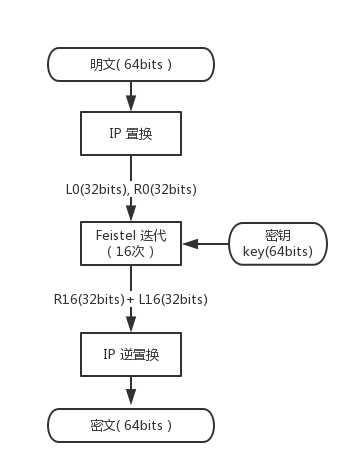
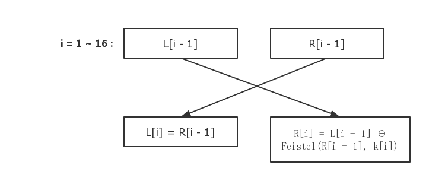
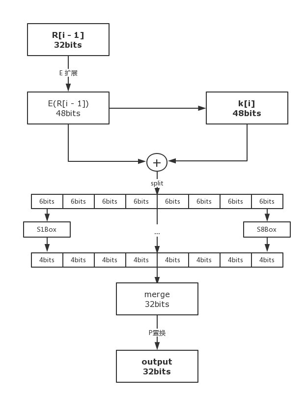
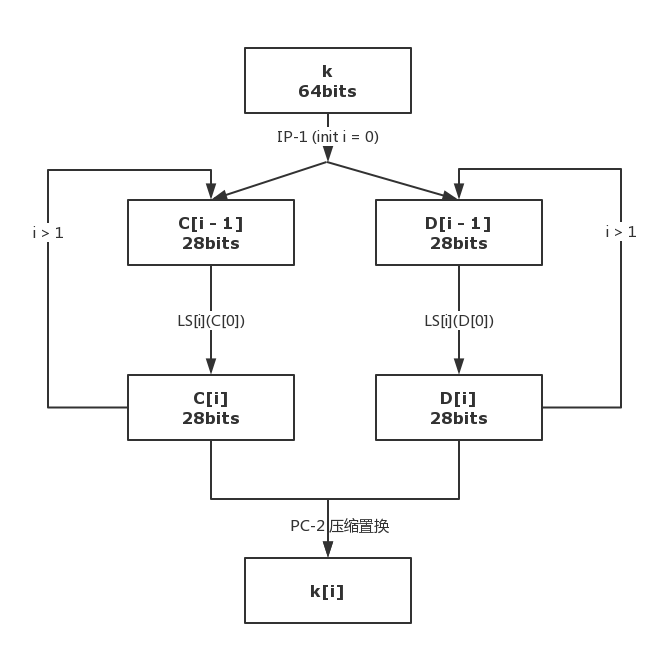

# 对称加密算法：Data Encryption Standard

所谓对称加密算法，指的是加密和解密使用相同密钥的加密算法，而 **Data Encryption Standard （数据加密标准）**，简称 DES，就是一种经典的对称加密算法。

DES 设计遵循 “**香农准则**”：

* **充分混乱**：密钥、明文以及密文之间的依赖关系相当复杂。
* **充分扩散**：密钥的每一位数字影响密文的许多位数字，明文的每一位数字也应影响密文的许多位数字。

DES 具有以下属性：

* **明文**：M = { m1, m2, ..., m64}，64bits 信息。
* **密文**：C = { c1, c2, ..., c64}，64bits 信息。
* **密钥**：K = { k1, k2, ..., k64}，64bits，8为奇偶校验位，有效位 56 bits。

作为一个经典的加密算法，DES 在数十年经久不衰，本文则希望通过自顶向下的方法，探讨一下 DES 算法的具体原理。

---

## 一、DES 流程概览

在 DES 算法中，明文会被分组成 64 位一组。而每一组依次进入算法加密，因此在此我们只讨论 64位一组的加密。

---

### 1.1 总流程图

忽略一部分细节，DES 整个流程可用下图表示：

这个图只是 DES 算法的大体过程，忽略了很大一部分技术细节，那些省略的细节也会在第二、三部分进行详细讲解。现在看不懂这个图也没有关系，后文将逐渐展开。看完第一部分，请回到这里，看看能否对 DES 算法过程有一个宏观认识。

---

###  1.2 IP 置换 （初始置换）

**s1**. 明文为 64bits 的信息，按下表所示进行重新排列，即新的第 1 位为原来的第 58 位，新的第 2 位为原来的第 50 位......原有信息被打乱，这个过程称之为 **IP 置换**。

**IP 置换表**：

|:---:|:----:|:---:|:---:|:---:|:---:|:---:|:---:|:---:|
| 58| 50| 42| 34| 26| 18| 10|  2|
| 60| 52| 44| 36| 28| 20| 12|  4|
| 62| 54| 46| 38| 30| 22| 14|  6|
| 64| 56| 48| 40| 32| 24| 16|  8|
| 57| 49| 41| 33| 25| 17| 9 |  1|
| 59| 51| 43| 35| 27| 19| 11|  3|
| 61| 53| 45| 37| 29| 21| 13|  5|
| 63| 55| 47| 39| 31| 23| 15|  7|

**s2**. 将经过 IP 置换重排后的信息分割成左右两部分 **L[0]** (32bits)，**R[0]** (32bits)。

---

### 1.3 Feistel 迭代

IP 置换后的 L[0], L[1] 以及 64bits 的密钥 k 作为 Feistel 函数的输入，经过 16 次相同迭代，输出 **L\[16] (32bits)** 和 **R\[16] (32bits)**。

*注：这部分细节将会在后续进行讲解*。

---

### 1.4 IP 逆置换

将经过 Feistel 迭代的左右子串 L16，R16 按照 **先右后左的 { R[16], L[16] }** 顺序排列，经过 IP 置换的逆关系 IP逆 进行置换混淆，产生最后输出的密文。

**IP 逆置换**：

|:---:|:----:|:---:|:---:|:---:|:---:|:---:|:---:|:---:|
| 40| 8| 48| 16| 56| 24| 64| 32|
| 39| 7| 47| 15| 55| 23| 63| 31|
| 38| 6| 46| 14| 54| 22| 62| 30|
| 37| 5| 45| 13| 53| 21| 61| 29|
| 36| 4| 44| 12| 52| 20| 60| 28|
| 35| 3| 43| 11| 51| 19| 59| 27|
| 34| 2| 42| 10| 50| 18| 58| 26|
| 33| 1| 41|  9| 49| 17| 57| 25|

---

上面这三步就是整个 DES 算法的大体步骤。不过也正如同前面所说，这里省略了大量步骤，其中一个关键的步骤就是被一笔带过的 **Feistel 迭代**，下面也将会从这里开始讲起。

---

## 二、Feistel 轮函数详解

### 2.1 初始置换后的 16 次迭代

在 IP 置换（初始置换）后，经过重新排列混淆的 64bits 信息被分为左右两部分： L0(32bits), R0(32bits)，这时候，它们要经过 16 次迭代，具体迭代过程如下图：

* **L[i]**： 直接为上一层的 R[i - 1]

* **R[i]**： 略微复杂一些，它是上一层的 L[i - 1] 与 Feistel 函数返回值的异或。

* **Feistel 函数**： 接受两个参数：R[i - 1] 和 k[i] （后面详解），返回一个 32bits 的值。

---

### 2.2 Feistel 函数

* 参数：R[i - 1]: 32bits, k[i]: 48bits

* 返回：32bits

---

#### **2.2.1 Feistel: 总流程**

**s1**. 32bits 的 R[i - 1] 通过 **E 扩展**，变为 48bits 的 E(R[i - 1])。

**s2**. E(R[i - 1]) **xor** k[i]，结果为 48bits。

**s3**. 将上述 xor 操作得到的结果分为 8 份，每份就是 6bits。

**s4**. 让第 i 份通过 **S(i)Box**，将会从 6bits -> 4bits。

**s5**. 将 8 份 4bits 数据组合成 32bits 的数据。

**s6**. 将上一步得到的 32bits 数据经过 **P置换**，然后输出 32bits 数据。

如下图：

---

#### **2.2.2 Feistel: E 扩展**

Feistel 函数的一个步骤是：将 32bits 的 R[i - 1] 扩展成 48bits 的 E(R[i - 1])，这个过程不难理解。

首先，将 32bits 的 R[i - 1] 转化为 **8 * 4** 的矩阵。

$$
\left[
\begin{matrix}
 1 & 2 & 3 &  4   \\
 5 & 6 & 7 & 8   \\
 \vdots & \vdots & \vdots& \vdots \\
 29 & 30 & 31 & 32     \\
\end{matrix}
\right]
$$

现在，我们要扩展这个矩阵，使其扩展成 **8 * 6** 的矩阵，**在首尾各增加一列**：

$$
\left[
\begin{matrix}
 32 & 1 & 2 & 3 & 4 & 5   \\
 4 & 5 & 6 & 7 & 8 & 9   \\
 \vdots & \vdots &\vdots & \vdots & \vdots& \vdots \\
 28 & 29 & 30 & 31 & 32 & 1    \\
\end{matrix}
\right]
$$

利用原矩阵数据，依次循环向后扩展。

---

#### **2.2.3 Feistel: S-Box**

**DES的核心是 S-Box**，除此之外的计算是线性的。S-Box 作为该密码体制的非线性组件对安全性至关重要，但 S-Box 的设计原理至今未公布，是否存在隐藏陷门 ( Hidden Trapdoors ) 不得而知。

**S-Box 的设计准则**：

* S-Box 中的每一行是整数 0-15 的一个置换
* S-Box 不是它输入变量的线性或仿射函数
* S-Box 的输入端每改变1位至少要引起输出端改变 2 位
* S(X) 和 S(X + 001100) 至少有 2 位不同
* 对 6 位二进制串 X = x1x2x3x4x5x6，S(X) != S(X + {11x5x600})
* S-Box 的输入端保持任 1 位不变，则其它输入位的变化输出数字中 0 和 1 的总数近于相等。

**S-Box 计算**：

设S[i] 的6位输入为 { b1 b2 b3 b4 b5 b6 }

* **行号**：r = ( b1 b6 )10

* **列号**：c = ( b2 b3 b4 b5 )10 

* **输出**：(S[i])\[r, c] 元素的值的二进制形式即为所要的 S[i] 的输出。

以 **S1-Box** 为例：

|14|4|13|1|2|15|11|8|3|10|6|12|5|9|0|7|
|0|15|7|4|14|2|13|1|10|6|12|11|9|5|3|8|
|4|1|14|8|13|6|2|11|15|12|9|7|3|10|5|0|
|15|12|8|2|4|9|1|7|5|11|3|14|10|0|6|13|

* **输入**：{ b1 b2 b3 b4 b5 b6 } = **101100**

* **行号**：( b1 b6 )10 = (10)10 = **2**

* **列号**：( b2 b3 b4 b5 )10 = (0110)10 = **6**

* **输出：** S1[2, 6] = **2** = **0010**

---

#### **2.2.3 Feistel: P 置换**

8 个 S-Box 最终会输出 8 组 4bits 的数据，将其合并为 32 bits，然后进行 P 置换，最后输出并参与 16 轮迭代。

**P 置换表**：

16|  7| 20| 21|
29| 12| 28| 17|
1| 15| 23| 26|
5| 18| 31| 10|
2|  8| 24| 14|
32| 27|  3|  9|
19| 13| 30|  6|
22| 11|  4| 25|

---

## 三、子密钥 k[i] 生成

在上述 Feistle 函数中，另一个参数就是 48bits 的 k[i]，而 k[i] 便是通过密钥 k 生成的。这部分的生成只与密钥 k 相关，不依赖明文密文，所以这一步完全可以在整个算法第一步完成。

用下图表示子密钥 k[i] 生成过程：

---

### 3.1 PC-1 置换

对 k 56bits 的非校验位进行 PC-1 置换混淆，得到左右各 28bits 两部分，记为 C[0], D[0]。

**PC-1 置换表**：

57| 49| 41| 33| 25| 17| 9|
1| 58| 50| 42| 34| 26| 18|
10|  2| 59| 51| 43| 35| 27|
19| 11|  3| 60| 52| 44| 36|
63| 55| 47| 39| 31| 23| 15|
7| 62| 54| 46| 38| 30| 22|
14|  6| 61| 53| 45| 37| 29|
21| 13|  5| 28| 20| 12|  4|

---

### 3.2 循环左移

从 i 开始，利用 C[i - 1], D[i - 1]，**计算 C[i], D[i]**。
* C[i] = LS\[i] (C[i - 1]) 和D[i] = LS\[i] (D[i - 1])
* **i = 1, 2, 9, 16** 时：LS\[i] (A) 表示 A 循环左移 1bit。
* **i = others** 时：LS\[i] (A) 表示 A 循环左移 2bits。  

可以用下表表示：  

|1|2|3|4|5|6|7|8|9|10|11|12|13|14|15|16|
|---|---|---|---|---|---|---|---|---|---|---|---|---|---|---|---|
|1| 1| 2| 2| 2| 2| 2| 2| 1| 2| 2| 2| 2| 2| 2| 1|  

---

### 3.3 PC-2 压缩置换

每一次循环，都拼接 C[i]D[i] 为 56bits 信息，进行 PC-2 压缩置换，压缩为 48bits，生成 **k[i]** 并输出。

**PC-2 压缩置换表**：

14| 17| 11| 24|  1|  5|
3| 28| 15|  6| 21| 10|
23| 19| 12|  4| 26|  8|
16|  7| 27| 20| 13|  2|
41| 52| 31| 37| 47| 55|
30| 40| 51| 45| 33| 48|
44| 49| 39| 56| 34| 53|
46| 42| 50| 36| 29| 32|

---

## 附：**全部 S-Box**

**S1**:

|14|4|13|1|2|15|11|8|3|10|6|12|5|9|0|7|
|0|15|7|4|14|2|13|1|10|6|12|11|9|5|3|8|
|4|1|14|8|13|6|2|11|15|12|9|7|3|10|5|0|
|15|12|8|2|4|9|1|7|5|11|3|14|10|0|6|13|

---

**S2**:

15|1|8|14|6|11|3|4|9|7|2|13|12|0|5|10|   
3|13|4|7|15|2|8|14|12|0|1|10|6|9|11|5|
0|14|7|11|10|4|13|1|5|8|12|6|9|3|2|15|
13|8|10|1|3|15|4|2|11|6|7|12|0|5|14|9|
              
---

**S3**:

10|0|9|14|6|3|15|5|1|13|12|7|11|4|2|8|   
13|7|0|9|3|4|6|10|2|8|5|14|12|11|15|1|   
13|6|4|9|8|15|3|0|11|1|2|12|5|10|14|7|   
1|10|13|0|6|9|8|7|4|15|14|3|11|5|2|12|   

---

**S4**:
 
7|13|14|3|0|6|9|10|1|2|8|5|11|12|4|15|   
13|8|11|5|6|15|0|3|4|7|2|12|1|10|14|9|   
0|6|9|0|12|11|7|13|15|1|3|14|5|2|8|4|   
3|15|0|6|10|1|13|8|9|4|5|11|12|7|2|14|   

---

**S5**:
 
2|12|4|1|7|10|11|6|8|5|3|15|13|0|14|9|   
14|11|2|12|4|7|13|1|5|0|15|10|3|9|8|6|   
4|2|1|11|10|13|7|8|15|9|12|5|6|3|0|14|   
11|8|12|7|1|14|2|13|6|15|0|9|10|4|5|3|   

---

**S6**:
 
12|1|10|15|9|2|6|8|0|13|3|4|14|7|5|11|   
10|15|4|2|7|12|9|5|6|1|13|14|0|11|3|8|   
9|14|15|5|2|8|12|3|7|0|4|10|1|13|11|6|   
4|3|2|12|9|5|15|10|11|14|1|7|6|0|8|13|   

---

**S7**:

|4|11|2|14|15|0|8|13|3|12|9|7|5|10|6|1|   
|13|0|11|7|4|9|1|10|14|3|5|12|2|15|8|6|   
|1|4|11|13|12|3|7|14|10|15|6|8|0|5|9|2|   
|6|11|13|8|1|4|10|7|9|5|0|15|14|2|3|12|

---

**S8**:

13|2|8|4|6|15|11|1|10|9|3|14|5|0|12|7|   
1|15|13|8|10|3|7|4|12|5|6|11|0|14|9|2|   
7|11|4|1|9|12|14|2|0|6|10|13|15|3|5|8|   
2|1|14|7|4|10|8|13|15|12|9|0|3|5|6|11|