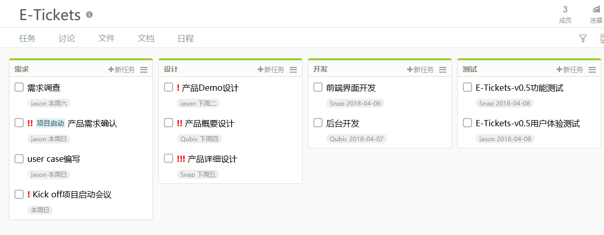

# 系统分析设计 Assignment 2

## 一、简答题

### 1. 简述瀑布模型、增量模型、螺旋模型（含原型方法）的优缺点。

**瀑布模型**：

优点：

* 项目按照阶段划分并提供检查点。
* 当前阶段完成后，只需要去关注后续阶段。
* 可在迭代模型中应用瀑布模型。
* 它提供了一个模板，这个模板使得分析、设计、编码、测试和支持的方法可以在该模板下有一个共同的指导。

缺点：

* 各个阶段的划分完全固定，阶段之间产生大量的文档，极大地增加了工作量。
* 由于开发模型是线性的，用户只有等到整个过程的末期才能见到开发成果，从而增加了开发风险。
* 通过过多的强制完成日期和里程碑来跟踪各个项目阶段。
* 不适应用户需求的变化。

---

**增量模型**：

优点：

* 将待开发的软件系统模块化，可以分批次地提交软件产品，使用户可以及时了解软件项目的进展。
* 以组件为单位进行开发降低了软件开发的风险。一个开发周期内的错误不会影响到整个软件系统。
* 开发顺序灵活。开发人员可以对组件的实现顺序进行优先级排序，先完成需求稳定的核心组件。当组件的优先级发生变化时，还能及时地对实现顺序进行调整。

缺点：

* 待开发的软件系统可以被模块化。如果待开发的软件系统很难被模块化，那么将会给增量开发带来很多麻烦。

---

**螺旋模型**：

优点：

* 通过原型的创建，使软件开发在每个迭代的最初明确方向
* 通过风险分析，最大程度地降低软件彻底失败造成损失的可能性
* 在每个迭代阶段植入软件测试，使每个阶段的质量得到保证
* 整体过程具备很高的灵活性，在开发过程的任何阶段自由应对变化
* 每个迭代阶段累计开发成本，使支出状况容易掌握
* 通过对用户反馈的采集，与用户沟通，以保证用户需求的最大实现

缺点：

* 过分依赖风险分析经验与技术，一旦在风险分析过程中出现偏差将造成重大损失
* 过于灵活的开发过程不利于已经签署合同的客户与开发者之间的协调
* 由于只适用大型软件，过大的风险管理支出会影响客户的最终收益

---

### 2. 简述 UP 的三大特点，其中哪些内容体现了用户驱动的开发，哪些内容体现了风险驱动的开发？

UP 统一过程的三大特点是：用例驱动、以体系结构为核心、迭代及增量。

用户驱动的开发由用例驱动来体现，开发过程中用例和场景的使用被证明是捕获功能性需求的卓越方法，并确保由它们来驱动设计、实现和软件的测试，使最终系统更能满足最终用户的需要。

风险驱动的开发体现在以架构为中心的迭代开发。因为没有稳固的架构就会带来高风险。

---

### 3. UP 四个阶段的划分准则是什么？关键的里程碑是什么？

1. 初始(Inception):大体上的构想、业务案例、范围和模糊评估。
2. 细化(Elaboration):已精化的构想、核心架构的迭代实现、高风险的解决、确定大多数需求和范围以及进行更为实际的评估。
3. 构造(Construction)：对遗留下来的风险较低和比较简单的元素进行迭代实现、准备部署。
4. 移交(Transition)：进行beta测试和部署。

关键的里程碑在细化之后，这是迭代的结束点，此时有重要决策或评估产生。

---

### 4. IT 项目管理中，“工期、质量、范围/内容” 三个元素中，在合同固定条件下，为什么说“范围/内容”是项目团队是易于控制的？

在 IT 项目管理中，“工期”是实现约定好的，不受项目团队控制；“质量”会被最终验收；只有范围和内容较为灵活，可以由团队自由发挥，因此易于控制。

---

### 5. 为什么说，UP 为企业按固定节奏生产、固定周期发布软件产品提供了依据？

UP 的四个阶段，使得开发被组织成一系列固定的短期小项目，小步骤，在每个阶段结束前，通过评估阶段目标是否满足要求从而决定是否进入下一阶段，每个阶段划分为多个迭代，每个迭代确定一个里程碑，因此说UP为企业按固定节奏生产、固定周期发布软件产品提供了依据。

----

## 二、项目管理

