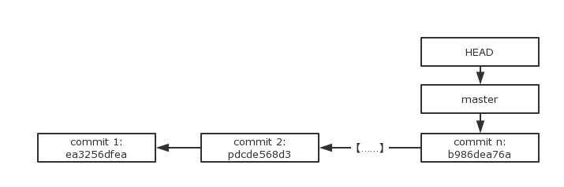
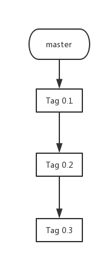
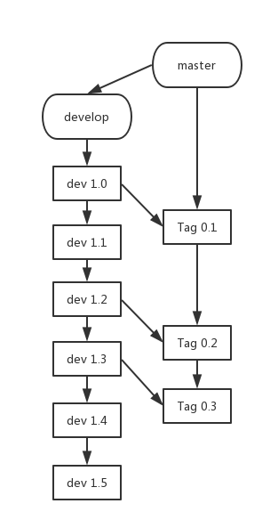
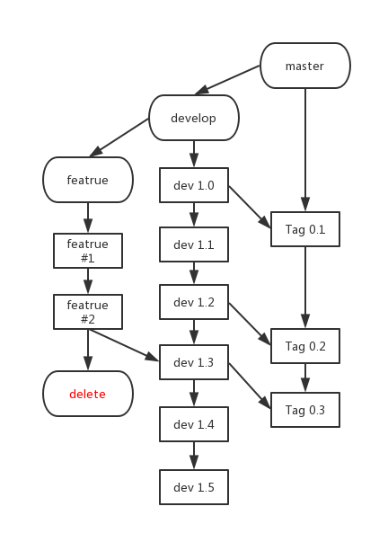
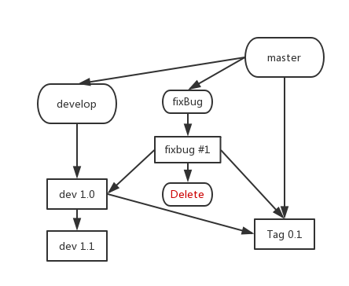
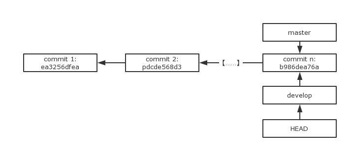
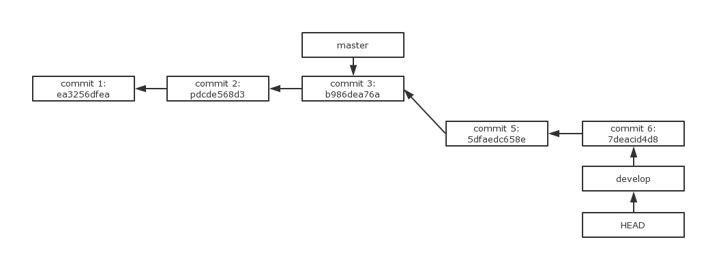
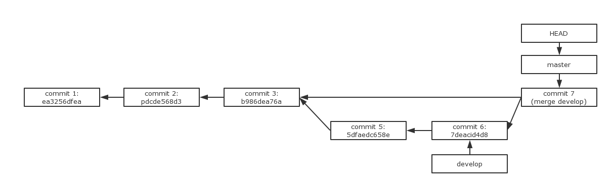
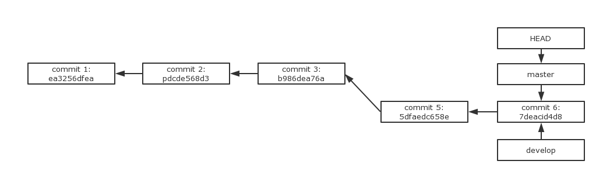

# Git 分支管理

本篇文章主要讨论 git 分支的操作，在此之前，可以看看前面的文章：

* [Git 使用手册（一）：Git 初探](/git/add-and-commit)

---

## master 分支

每个 Git 仓库创建的时候都会将 **master** 作为默认分支，你在默认情况下的所有 commit 都是在 master 分支上。

而在 Git 内部，每个 commit 都连接着前一个 commit，以链表的形式进行组织，就像下图这样：



*( 注：下面的乱码是计算机存储的哈希值 )*

图中的 HEAD 指针总是指向本地仓库当前的分支，在本例中是 master，而 master 主分支的指针，会指向一个 commit，这也是当前分支最新的 commit。

---

## 分支管理

### 想象这样的场景

你发起了一个大项目，希望多个人协同为项目写代码，而每个人的分工不同：

* 甲负责开发新的功能
* 乙负责修 Bug
* 你负责维护整个项目

甲和乙在打完自己自己的代码的情况下，把自己的代码分别 commit ，然后都 push 到了master 分支上。然后分支上交替出现了这些 commit：

**"Add function #1", "Fix bug #4", "Fix bug #5", "Add function #2" ...**

emmmmm... 只是 commit 有点乱，似乎还能接受。

但是问题来了，甲负责新加功能，然而功能根本没有写完，这时候原本能跑的程序根本无法运行！然后，你发现自己根本无法维护代码……你就疯了。

---

### 单分支窘境

我们从上面随手编的小故事可以发现，如果只有一个分支，不仅会使得开发变得非常混乱，而且难以维护。

解决方案也很简单：**让不同的分支负责不同的功能**！

---

### 多分支开发

还是刚才的故事，如果你们的开发遵循以下规则：

* master 分支负责保存所有可以发布的 commit。

* 甲在一个名叫 Develop 的分支开发，功能开发完成合并到 master 中。

* 乙在 FixBug 分支上改 Bug，改完 Bug 将分支合并到 master 中。

这样能够使得你的开发变得分工明确，不易出错便于管理。

---

### Vincent Driessen 分支策略

Vincent Driessen 提出的一个分支管理的策略，可以使得版本库的演进保持简洁，主干清晰，各个分支各司其职、井井有条。

---

#### 1. master 分支

master 分支只负责 commit 重大版本，所有用于发布的版本都会在 master 分支上。



---

#### 2. develop 分支

develop 分支负责日常开发，开发完成则 **合并( Merge )** 到 master 分支。



---

#### 3. feature 分支

feature 开发一些功能，开发完成后合并到 develop 分支，然后删除。



---

#### 4. fixBug 分支

用于修复在 master 和 develop 分支中的 Bug，修复完成后合并入 develop 和 master 分支，之后删除。



---

#### 总结

1. **master** 分支上只有较大的可发布版本。
2. **develop** 分支负责日常开发。
3. 一般来说，只有 **master** 和 **develop** 两个分支。
4. 添加新的功能时，从 **develop** 分支新建 **feature** 分支，功能完成后合并入 **develop**，然后删除 **feature** 分支。
5. 遇到 bug 时候，从 **develop** 分支新建 **fixBug** 分支，修补完成后合并入 **master** 和 **develop** 分支，然后删除 **fixBug** 分支。

## 分支命令

### 新建分支

在需要新的分支的时候，我们使用如下命令：

```
git branch newBranch       //基于当前分支创建新分支newBranch
git checkout -b newBranch  //创建新分支newBranch并切换到newBranch
```

以 **git checkout -b develop** 为例，此时我们的 commit 图变成了这样：



git 会创建一个 **develop** 指针指向 master 指向的 commit，并将 **HEAD** 指针指向 develop，表示当前工作区在 develop 分支下。

---

### 切换分支

我们需要切换分支的时候，使用 **git checkout** 命令：

```
git checkout develop  //切换到develop分支
```

切换分支的时候，git 会将 HEAD 指针指向你切换到的分支。

---

### 合并分支

当两个分支需要合并的时候，例如现在是这个样子的：



而我们想要**在 master 分支上合并 develop 分支**。

```
git checkout master        //切换到master分支
git merge develop --no-ff  //合并develop到当前分支
```

此时，commit list 变成了这样：



#### 关于 **-\-no-ff** 参数

这个参数是“**不使用快速合并**”的意思。去掉 **-\-no-ff** 参数，如果 master 需要合并的 develop 分支的父节点，也就是本例所示，会进行快速合并操作：即直接将 master 指针指向 develop 当前的 commit，没有留下分支合并的记录。如下图：




而使用了 -\-no-ff 参数的分支合并，会忠实地记录每一次分支合并信息。因此个人倾向一直使用 **git merge {branch} -\-no-ff** 进行分支合并。

---

### 分支删除

当想要删除某一分支的时候，使用 **git branch -d {branchName}**

```
git branch -d fixBug    //删除fixBug分支
```
