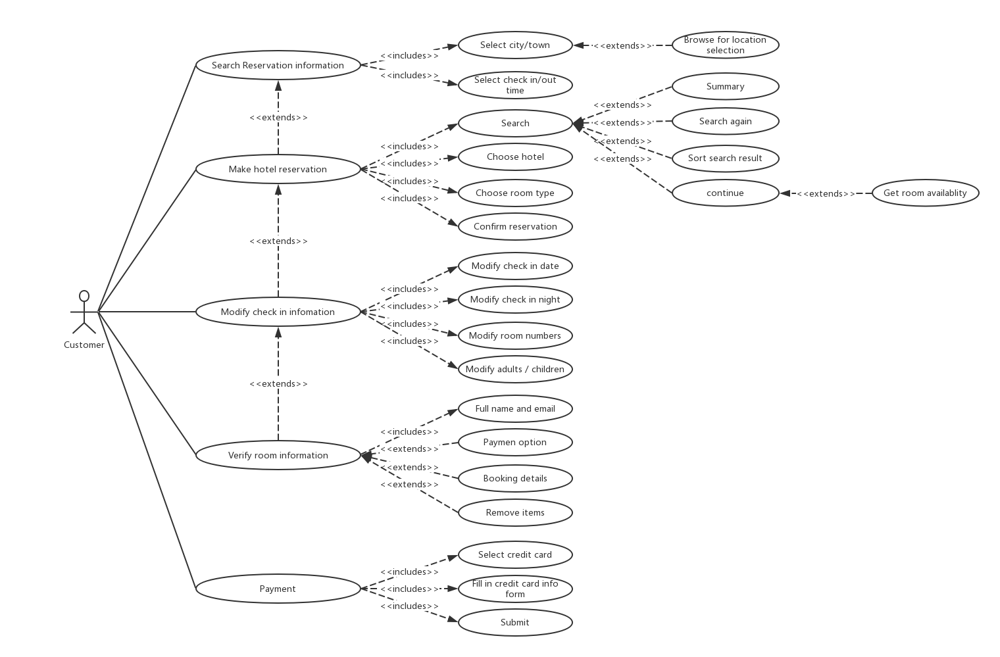
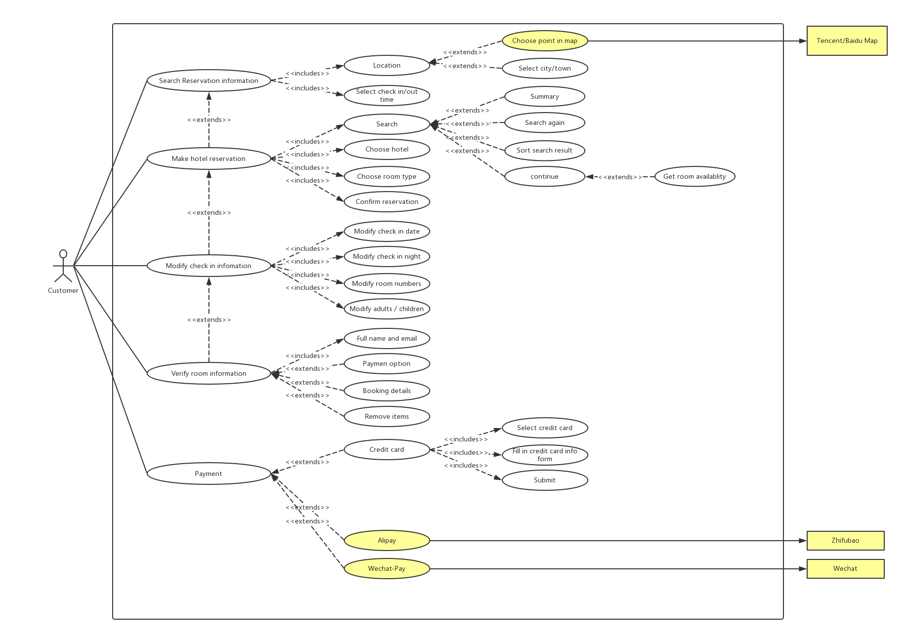
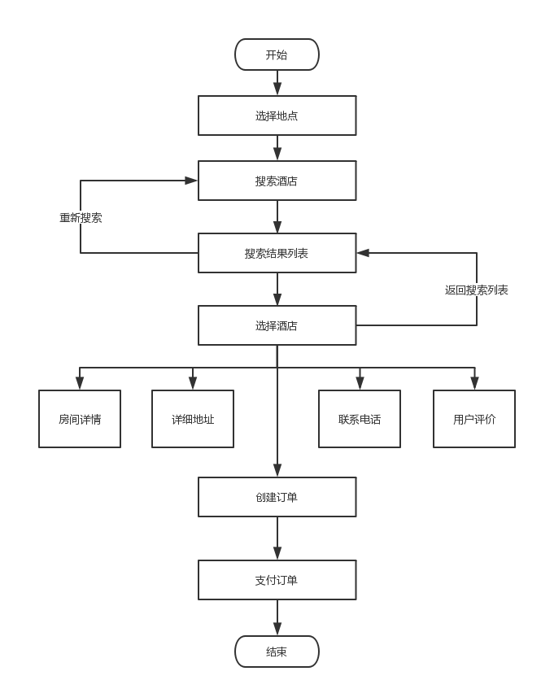
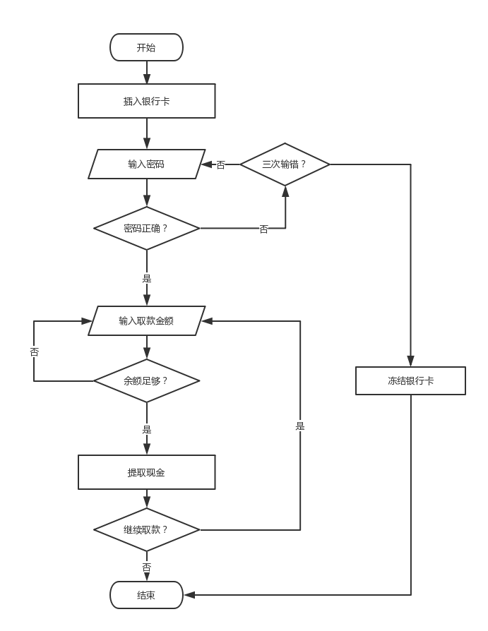
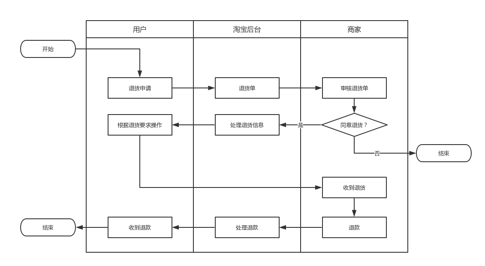

# 系统分析设计 Assignment 4

## 一、用例建模

### a. 阅读 Asg_RH 文档，绘制用例图。

---

### b.  选择你熟悉的定旅馆在线服务系统（或移动 APP），绘制用例图。

满足以下要求：

* 对比 Asg_RH 用例图，请用色彩标注出创新用例或子用例

---

### c. 对比两个时代、不同地区产品的用例图，总结在项目早期，发现创新的思路与方法

* 不同时代，用户的使用习惯，审美都会发生较大改变，可以根据同时代受欢迎的产品，找到其特点并运用到自己的产品中。
* 进行市场调研，根据不同地区的使用习惯以及侧重来确定针对不同地区的少部分“本地化”需求。

---

### d. 请使用 SCRUM 方法，在（任务b）用例图基础上，编制某定旅馆开发的需求 （backlog）

| ID | Name | Imp | Est | How to preview |
|:---|:---|:---|:---|:---|
|1|用户注册|9|2|用户利用手机号进行注册|
|2|用户登录|9|2|已注册用户根据手机号登录，也可使用微信登录|
|3|搜索酒店|9|5|根据酒店名、所在地点、入住时间查找酒店|
|4|进入酒店详情|8|6|酒店详细地址、评价、房型、电话、空房数量等详细信息|
|5|创建订单|8|2|选择入住及退房时间、房间类型|
|6|提交订单、支付|9|2|提交订单，并利用银行卡、支付宝微信进行支付|

---

## 二、业务建模

### a. 在（任务b）基础上，用活动图建模找酒店用例。简述利用流程图发现子用例的方法。

---

### b. 选择你身边的银行 ATM，用活动图描绘取款业务流程

---

### c. 使用多泳道图，表达客户、淘宝网、淘宝商家服务系统、商家等用户和系统协同完成退货业务的过程。

---

## 三、用例文本编写

在大作业基础上，分析三种用例文本的优点和缺点

### 1. 摘要（Brief）

* **优点**：编写速度快，简洁。

* **缺点**：对具体场景描述不够请悉细致。

---

### 2.非正式（Casual）

* **优点**：编写相对简洁；比简洁的用例文本更加详细，对问题的阐述更加清晰。

* **缺点**：仍不够正式，有细节需要优化。

---

### 3.详述（Detailed）

* **优点**：内容详细，细节到位，对所有问题都阐述清晰，不会产生误解。

* **缺点**：编写起来十分复杂，耗费大量时间。