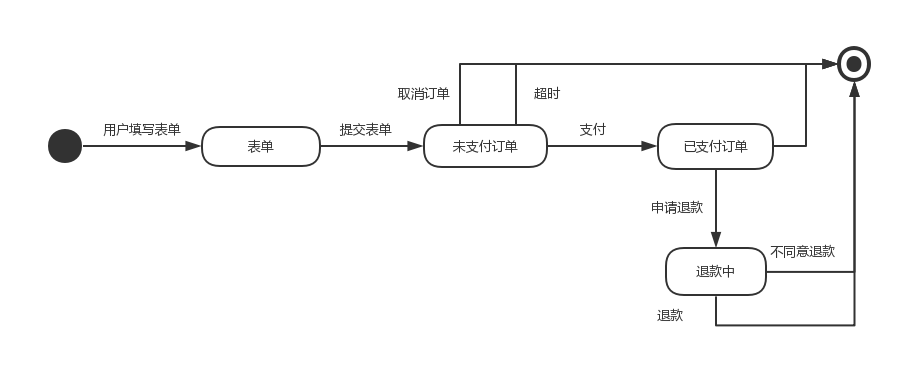
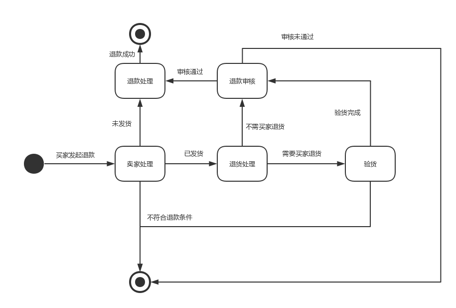

# 系统分析设计 Assignment 6

## 一、使用UML State Model

* 建模对象： 参考 Asg_RH 文档， 对 Reservation/Order 对象建模。

* 建模要求： 参考练习不能提供足够信息帮助你对订单对象建模，请参考现在 定旅馆 的旅游网站，尽可能分析围绕订单发生的各种情况，直到订单通过销售事件（柜台销售）结束订单。

---

## 二、研究淘宝退货流程活动图，对退货业务对象状态建模

