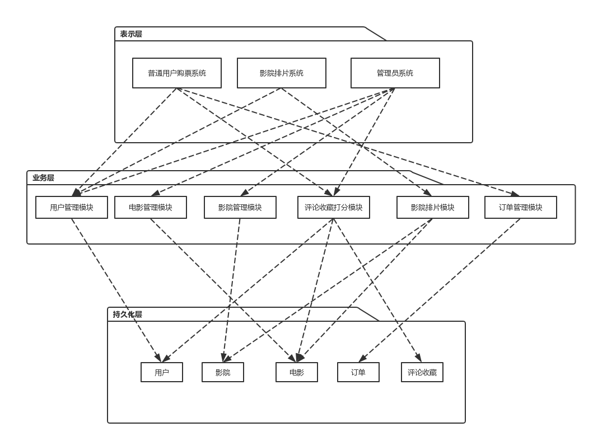

# 系统分析设计 Assignment 8

## 一、软件架构与框架之间的区别与联系

**软件架构**：软件架构是有关软件整体结构与组件的抽象描述，用于指导大型软件系统各个方面的设计。

**框架架构**：框架架构是一个软件的基础，可以理解为软件开发者提供的工具和环境，能够让生产更加效率化。

它们的区别在于软件架构往往是问题的抽象解决方案，关注大局而忽略细节。而软件框架则是一定意义上的半成品，需要根据实际要生产的产品做进一步的开发。而它们的联系在于，都是采用“分治”的思想，从整体到局部，最后到细节。

---

## 二、案例：E-tickets

## 三、三层架构的便利

从开发角度来讲，三层架构能让每一层专注实现自己的逻辑即可。在 DAO 层，我们只需要做好与数据库的交互即可，无需考虑业务逻辑，如果遇到异常也可以直接 raise 给业务层去处理。而在 Service 层，则是专注实现业务逻辑，此时需要周全考虑可能发生的情况，处理异常。对于服务端开发来说，表示层只需要拿到前端传来的数据，传递参数，调取对应的 service 即可。

这使得开发更加的规范化，每一层与每一层之间各司其职，上层调用下层。在 debug 的时候也能够更加精准发现问题。

---

## 四、研究 VUE 与 Flux 状态管理的异同

Flux 是一种架构思想，将一个应用分成四个部分：

* View： 视图层
* Action（动作）：视图层发出的消息（比如mouseClick）
* Dispatcher（派发器）：用来接收 Actions、执行回调函数
* Store（数据层）：用来存放应用的状态，一旦发生变动，就提醒Views要更新页面

Flux 中，数据是单向流动的，视图层组件不允许直接修改应用状态，只能触发 action。应用的状态必须独立出来放到 store 里面统一管理，通过侦听 action 来执行具体的状态操作。

而 Vue 本身就是一个 UI 层框架，使用 MVVM 模式，并不涉及状态管理等概念。而 Vuex 则实现了状态管理：

* 全局使用一个 State
* store 存放应用状态
* 通过提交 mutation 改变状态
* 通过 action 提交 mutation

Vuex 可以算作 Flux 的一种实现。