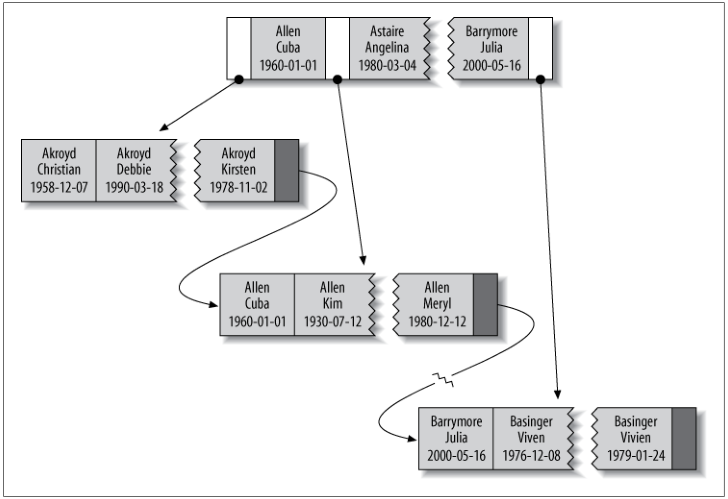

# 创建高性能 MySQL 索引

本文内容参考 《高性能MySQL》 第五章。

## 一、 索引类型

### 1.1 B-Tree 索引

B-Tree 索引是 InnoDB 和 MyISAM 引擎默认的索引类型，内部使用 B+Tree 存储。

B-Tree 索引按照你指定的索引列顺序存储，假设数据表是这样的:

```sql
CREATE TABLE people
    last_name varchar(50) not null,
    first_name varchar(5) not null,
    dob date not null,
    gender enum('m', 'f') not null,

    KEY(last_name, first_name, dob) /*这是索引列*/
);
```

索引在内部存储的其实是这个样子的：



可以看到，索引中按序包含 last_name, first_name, dob 三个值。

该索引可以高效的进行：

* **全值匹配**：和索引中的所有列进行匹配，即提供上例的 last_name, first_name, dob 三个值。

* **最左前缀匹配**：按照索引创建顺序等值匹配，直到遇到范围查询为止，注意不能跳过任何索引列。

* **只访问索引的查询**：SELECT 的数据列就在索引中，那么查询只会访问索引而不是真正的数据，这种优化方式称为 “索引覆盖” 优化。

---

### 1.2 HASH 索引

顾名思义哈希索引就是利用哈希算法快速定位数据的一种技术，只有 Memory 引擎显式支持，InnoDB 和 MyISAM 并不支持该索引，语法如下：

```sql
CREATE TABLE hash_index_test(
    rid int NOT NULL AUTO_INCREMENT,
    col_key int,

    PRIMARY KEY(`rid`),
    KEY USING HASH(col_key) /*哈希索引创建*/
)ENGINE=MEMORY;

```

内部使用哈希表实现，哈希表中存储每一行的指针，如果冲突则使用链表存储。和 B-Tree 索引比较，哈希索引只支持等值比较，包括 =, IN(), <=>，不支持范围查询

---

### 1.3 FULLTEXT 索引

全文（FULLTEXT）索引，原来只有 MyISAM 引擎支持，新版本的 InnoDB 也开始支持全文索引。它查找的是文本中的关键词而不是等值匹配。只能在 char, varchar, text 上建立该索引。在查询时，会计算出一个相关度值，做一个排序并选取相关度高的返回，语法如下：

```sql
CREATE TABLE fulltext_index_test(
    rid int NOT NULL AUTO_INCREMENT,
    text_col text,

    PRIMARY KEY(`rid`),
    FULLTEXT(text_col) /*全文索引创建*/
)ENGINE=MyISAM;

/*查询语法*/
SELECT * FROM fulltext_index_test WHERE MATCH(text_col) AGAINST('keyword')
```

---

## 二、索引策略

### 2.1 索引选择性

所谓索引的选择性（Selectivity），是指不重复的索引值（也叫基数，Cardinality）与表记录数 T 的比值：**Index Selectivity = Cardinality / T**。


显然选择性的取值范围为(0, 1]，选择性越高的索引价值越大。

---

### 2.2 前缀索引

前缀索引主要针对字符串的数据结构，它可以仅仅对字符串的前缀位做索引记录，从而减少索引大小。建立前缀索引的诀窍在于，选择的长度要能够满足索引的选择性足够高但又不能太长。

可以使用如下方式计算：

```sql
/*完整选择性*/
SELECT COUNT(DISTINCT city) / COUNT(*) as selectivity
FROM country;

/*前缀索引选择性*/
SELECT COUNT(DISTINCT left(city, 7)) / COUNT(*) as prefix_selectivity
FROM country;
```

只要前缀选择性接近完整选择性，即可选用前缀索引：

```sql
ALTER TABLE country ADD INDEX(city(7));
```

---

### 2.3 多列索引

通过 1.1 索引的数据结构，对每个列建立索引和对多列建立索引是完全不一样的，多个单列索引是无法进行最左匹配的，因此请尽量避免下面这样的索引：

```sql
CREATE TABLE _table (
    col1 int,
    col2 int,
    col3 int,

    KEY(col1),
    KEY(col2),
    Key(col3)
);
```

而要改成：

```sql
CREATE TABLE _table (
    col1 int,
    col2 int,
    col3 int,

    KEY(col1, col2, col3)
);
```

所谓索引的最左匹配原则，是指索引在匹配的时候总是从左到右直到遇到第一个范围查询（>, <, BETWEEN AND）。

如上 **(col1, col2, col3)** 的索引：

* **WHERE col1=1 and col2=2 and col3=3**这样的语句能用到所有索引。

* **WHERE col1=1 and col2 BETWEEN 2 and 3 and col3=4** 这样的语句则只会使用索引的第一列 col1。

基于索引的数据结构，选择多列索引的策略在于：**前面的列尽量是选择性高的列或经常查找的列**。

---

这里有一个小技巧，如果你想要跳过第一列 col1 而匹配第二列 col2，且 col1 是可以枚举的，那么可以采用这样的语句：

* **WHERE col1 IN (1, 2, 3, 4) and col2=5**

这样的话，col1 和 col2 的索引都可以被利用，非常高效。同时值得一提的是，在 MySQL 中，IN 语句和等价的 or 语句是不一样的，IN 语句内部是先对 IN 里面的内容进行排序，再将不同索引值进行二分查找，因此比 or 要高效。

---

### 2.4 聚簇索引

聚簇索引并不是一种单独的索引类型，而是一种数据储存方式。具体细节依赖于其实现方式。而聚簇则表示数据在物理空间中紧凑，聚簇索引就是可以直接拿到物理空间对应数据的索引。

InnoDB的聚簇索引实际是在同一个结构中保存了B-Tree索引和数据行。

因为无法把数据行同时储存在两个地方，所以一个表只能有一个聚簇索引。InnoDB使用主键聚集索引，别索引的列就是主键列。若没有主键，InnoDB会选择一个非空索引代替。

---

为了更深入理解，我们看一下两个数据库引擎的底层索引实现：


**MyISAM**：

MyISAM 所有索引都一样，因此没有聚簇索引概念。

MyISAM 引擎中数据是按照插入顺序排列在磁盘中的，因此可以理解为有一个隐式的 row_id，而主键索引和其它索引没有任何区别，只是一个唯一非空索引罢了，它指向了这个 row_id，从而找到它对应的数据。其它索引也一样，指向的都是 row_id，从而拿出数据。

**InnoDB**：

InnoDB 和 MyISAM 不同的是，数据按照主键（Primary Key）聚簇，因此 Primary Key 其实包含了数据所有的信息。

二级索引则存储的是主键值，因此通过二级索引进行数据检索时，其实是先铜鼓二级索引查找出 Primary Key，再通过主键索引查找出对应的数据，也就是进行两次索引检索。

---

**聚簇索引优点**：

1. 使用聚簇索引效率高，因为索引就存着所有的数据。
2. 可以把相关数据保存在一起。

**聚簇索引缺点**：

1. 更新聚簇索引列的代价很高，因为会强制 InnoDB 将每个被更新的行移动到新的位置。
2. 若主键更新，可能导致页分裂。
3. 二级索引需要两次索引查找，而不是一次，使用下文的覆盖索引可以避免两次查询，但使用情景有限。

---

### 2.5 覆盖索引


如果一个索引包含所有需要查询的字段的值，那就称之为 “覆盖索引”，覆盖索引可以极大地提高性能，因为只需要扫描索引而无须回表再查一次。

对于InnoDB的聚簇索引来说，使用二次索引需要二次查询，而使用覆盖索引则可以避免这样的事情。

---
