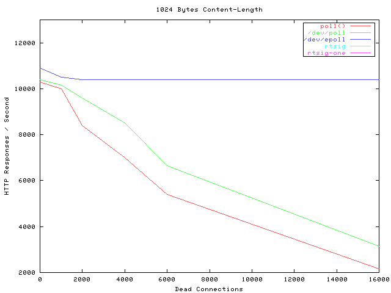
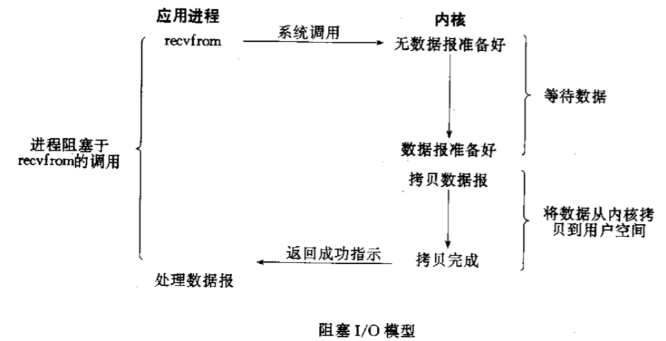
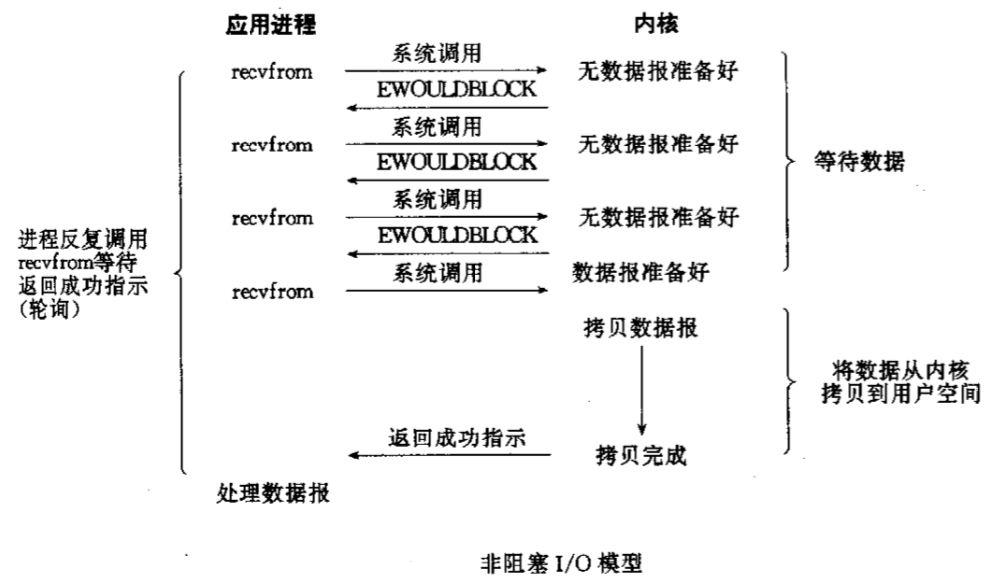

本文的主题只有一个：谈一谈服务器如何解决高并发问题。

想写相关的博客已经很久了，苦于自己的理解并不充分，就一直搁置了。但是最近在做学校的系统分析设计项目负责后台开发，同时在腾讯微信实习，对这部分的理解也不断深入，于是想要做一个总结。

# 一、从历史讲起

## 1.1 多线程/多进程

从一开始，人们就想让一台服务器能够处理尽量多的并发连接请求，能够想到的最简单的方法就是使用多进程/多线程的方式，遇到一个连接，系统就 fork 出一个子进程或者造出一个线程去 handle 这个连接。这个方案开始十多年一直很好用，因为那个时候计算机尚未普及，没有太大压力。

---

## 1.2 C10K 问题

随着计算机网络的覆盖，基于原来的多进程/多线程的模式越来越力不从心，其实想一想就能明白问题所在：如果给每个连接都开一个进程/线程，那么你开的最大线程数就是这个服务器的并发数量，如果 1000 个连接就要开 1000 个线程才可以。

这个时候，人们提出了著名的 C10K 问题：**如何才能让服务器单机可以处理 10K 数量级的并发连接**。

---

## 1.3 I/O 多路复用

### 1.3.1 思想

为了解决 C10K 问题，人们发明了一个叫做 select 的函数，宣告了 I/O 多路复用技术的诞生。

它的主要思想在于：**无需开那么多进程/线程，只需要一个就够，这一个线程控制着所有连接的句柄，如果哪个句柄出现了 I/O 流，我可以找到它，让它 I/O**。

举一个餐厅提供服务的例子：

* 多线程多进程：是有多少客人，雇佣多少服务员去服务，即使顾客现在不需要被服务。
* I/O 多路复用：只顾一个或少量的服务员，谁需要服务，就去提供服务。

---

### 1.3.2 select

select 当然是这个技术的第一个实现了。但是 select 函数的限制在于，select 函数只会告诉你，有一个 sock 开始 I/O 了哦，但是它无法告诉你是哪一个，我们需要一个一个遍历所有注册的句柄，才能找到它；并且它的最大的注册数量限制为 1024。

虽然 select 有这些不足，但是在当时那个年代已经是神一般的存在了，在很长一段时间都能满足需求了。早期 Apache 也是使用 select 来支持海量连接的。

### 1.3.3 poll

poll 是在 select 14年之后提出来的，它对 select 做出了一些改进，同时也去掉了 1024 的连接限制，但仍然需要遍历所有注册句柄才能找到需要 I/O 的那一个。

### 1.3.4 epoll

5 年后，epoll 实现，这也是 I/O 复用技术最新的实现了，它解决了 select, poll 函数的绝大多数问题：不仅告诉你有句柄产生了数据，还会告诉你是哪个句柄，Nginx 目前的 I/O 复用模型就是 epoll。有兴趣的同学可以自己看看 epoll 这个系统调用的使用方法，在这里我就不贴代码了。

epoll 真正做到了神一般的性能，它的性能几乎不受并发数影响，就是下图蓝色的线：

*注：Dead Connections 只是因为那个测试工具的名字有个 Dead，其实就是连接数的意思*。

---

# 二、事件驱动

I/O 多路复用其实就是事件驱动模型的实质，高性能 I/O 设计模式 Reactor 核心就是事件驱动，在了解它之前，还需要一些别的东西。

## 2.1 计算任务划分

### 2.1.1 计算密集型

计算密集型任务的主要特点就是计算，CPU 使用率非常的高，对于大型神经网络这些任务，CPU 已经满足不了计算要求了，因此需要使用 GPU 才可以。对于计算密集型任务，CPU 几乎不带空闲的。

### 2.1.2 I/O 密集型

我们知道 I/O 的速度远远低于 CPU 的速度，因此在 I/O 密集型任务中，CPU 有 99% 以上的时间其实是空闲的，仅仅是等待 I/O 而已。而 web 服务是一个典型的 I/O 密集型任务，也正是因为它是个 I/O 密集型任务，所以 C/C++ 和 Python 之类的脚本语言比没有太大优势，原因也很简单，CPU 基本上总是空闲的。

---

## 2.2 I/O 多路复用没解决的问题

I/O 多路复用技术，实际上就是可以让一个线程监听多个 fd，当这些 fd 产生 I/O 事件时，能够通知相应处理程序去读写。至于读写的问题，就只能交给后续的 I/O 处理程序了，因此如果后续的 I/O 事件处理程序卡住的话，整个系统依然是阻塞的。

一个可行的解决方案是，I/O 多路复用配合多线程的解决方案，主线程通过 I/O 多路复用负责监听事件，监听到事件之后，通过一个事件分发器分发给相应的处理线程，然后处理线程进行处理，与复用模块互不影响。

而这个解决方案的弊端在于，处理线程不知道啥时候能够读到这些数据，如果产生了一个读事件通知处理线程读，然而此时缓冲区里没有数据的话，线程会一直傻傻等到直到缓冲区有数据且读完所有数据为止。

况且，每个线程都需要占用资源，线程一多的时候的上下文切换都会限制性能。

---

## 2.3 阻塞、非阻塞 I/O

很多人将同步，阻塞I/O 和 异步、非阻塞 I/O 混为一谈，但是其实它们并不是同一个东西。

### 2.3.1 阻塞 I/O

* 如果要 recv 或者 read 数据的时候，fd 缓冲区里如果有数据那么我就读取它，如果没有数据的话我就一直卡在这里不走了。

* 如果要 send 或 write 数据的时候，如果缓冲区满了，那么一直等待知道我把数据全部写进去才会走。

这里引用《Unix 网络编程》的一幅图：

### 2.3.3 非阻塞 I/O

* 如果要 recv 或者 read 数据的时候，fd 缓冲区里如果有数据那么我就读取它，没有数据的话就带着 EGAIN 异常和 -1 立即返回，过一会儿再问。

* 如果要 send 或者 write 数据的时候，如果缓冲区满了，带着 EGAIN 异常和 -1 返回，过一会儿再问。

---

## 2.5 异步I/O

首先明确一个概念，之前提到的 I/O 多路复用，阻塞、非阻塞 I/O 的本质都是同步的，即使是非阻塞 I/O，在数据准备好以后还是会阻塞直到拿到所有数据为止。

异步的概念就是，操作立即返回，完成之后执行一个约定的回调函数。

我个人感觉异步是一个更偏向高层的概念。比如 Node.js 通过回调函数提供了异步的接口，而 Python 则是通过协程提供异步的接口。引用一张图吧：

---

## 2.6 Reactor 模式

还记得 2.2 中说的那个多线程解决方案了吗，其实只需要把事件处理线程设置为非阻塞 I/O，这个方案性能就很高了。著名的高性能 I/O 设计模式 Reactor 其实也是类似的思想。

Reactor 的方案大体如下：

* I/O复用模块利用 epoll 监听每个 fd 上是否有事件发生。
* 事件发生时，事件分发器分发给响应的处理线程。
* 事件处理线程处理完成后，注册新的事件。

