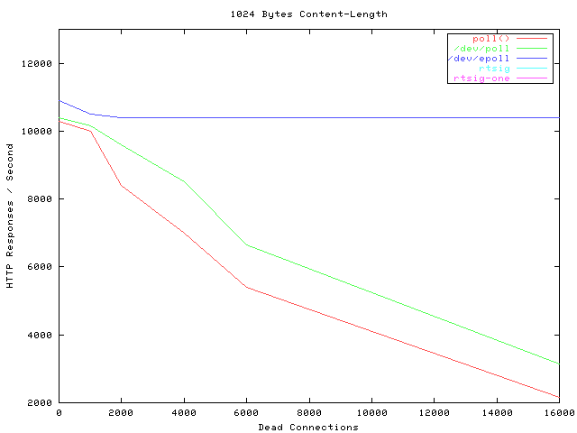

本文的主题只有一个：谈一谈服务器如何解决高并发问题。

想写相关的博客已经很久了，苦于自己的理解并不充分，就一直搁置了。但是最近在做学校的系统分析设计项目负责后台开发，同时在腾讯微信实习，对这部分的理解也不断深入，于是想要做一个总结。

# 一、从历史讲起

## 1.1 多线程/多进程

从一开始，人们就像让一台服务器能够处理尽量多的并发连接请求，能够想到的最简单的方法就是使用多进程/多线程的方式，遇到一个连接，系统就 fork 出一个子进程或者造出一个线程去 handle 这个连接。这个方案开始十多年一直很好用，因为那个时候计算机尚未普及，没有太大压力。

---

## 1.2 C10K 问题

随着计算机网络的覆盖，基于原来的多进程/多线程的模式越来越力不从心，其实想一想就能明白问题所在：如果给每个连接都开一个进程/线程，那么你开的最大线程数就是这个服务器的并发数量，如果 1000 个连接就要开 1000 个线程才可以。

这个时候，人们提出了著名的 C10K 问题：**如何才能让服务器单机可以处理 10K 数量级的并发连接**。

---

## 1.3 I/O 多路复用

### 1.3.1 思想

为了解决 C10K 问题，人们发明了一个叫做 select 的函数，宣告了 I/O 多路复用技术的诞生。

它的主要思想在于：**无需开那么多进程/线程，只需要一个就够，这一个线程控制着所有连接的句柄，如果哪个句柄出现了 I/O 流，我可以找到它，让它 I/O**。

举一个餐厅提供服务的例子：

* 多线程多进程：是有多少客人，雇佣多少服务员去服务，即使顾客现在不需要被服务。
* I/O 多路复用：只顾一个或少量的服务员，谁需要服务，就去提供服务。

---

### 1.3.2 select

select 当然是这个技术的第一个实现了。但是 select 函数的限制在于，select 函数只会告诉你，有一个 sock 开始 I/O 了哦，但是它无法告诉你是哪一个，我们需要一个一个遍历所有注册的句柄，才能找到它；并且它的最大的注册数量限制为 1024。

虽然 select 有这些不足，但是在当时那个年代已经是神一般的存在了，在很长一段时间都能满足需求了。早期 Apache 也是使用 select 来支持海量连接的。

### 1.3.3 poll

poll 是在 select 14年之后提出来的，它对 select 做出了一些改进，同时也去掉了 1024 的连接限制，但仍然需要遍历所有注册句柄才能找到需要 I/O 的那一个。

### 1.3.4 epoll

5 年后，epoll 实现，这也是 I/O 复用技术最新的实现了，它解决了 select, poll 函数的绝大多数问题：不仅告诉你有句柄产生了数据，还会告诉你是哪个句柄，Nginx 目前的 I/O 复用模型就是 epoll。

epoll 真正做到了神一般的性能，它的性能几乎不受并发数影响，就是下图蓝色的线：

*注：Dead Connections 只是因为那个测试工具的名字有个 Dead，其实就是连接数的意思*。

---

# 二、计算任务划分

## 2.1
