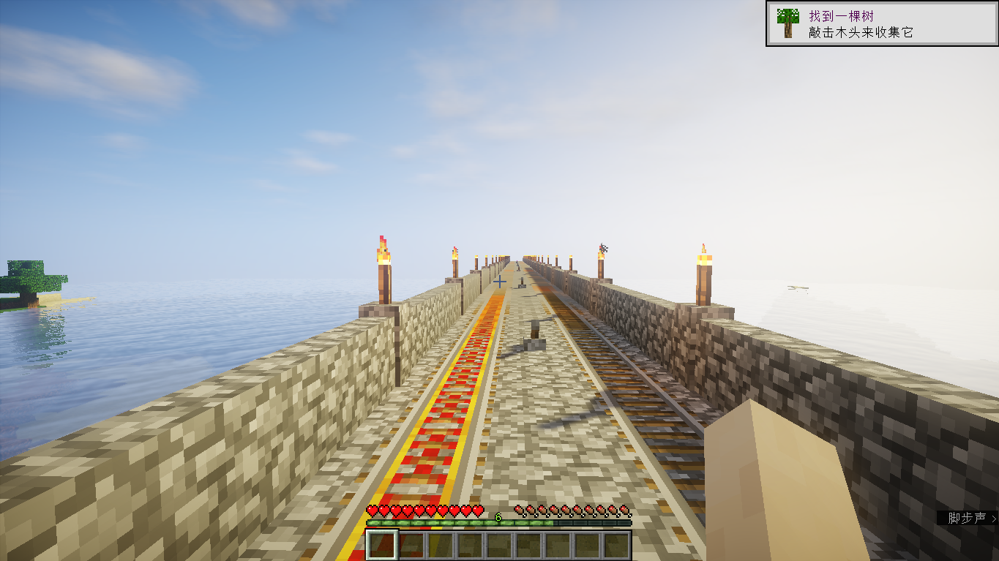

# My Journey

## 一、醒来

史蒂夫醒来了，看着这个陌生的世界……

他在一座山上，旁边似乎是一条河，周围全是橡树，附近还有一个人和他一样刚刚出现在这里，叫做 Snap，他们自然的结了伴。

他们找到了一条下山的小路，走到了一片森林。

史蒂夫发现自己可以出拳，可以跳跃，他对着一棵树不停出拳的时候，这颗树的一块木头被他挖下来了，他震惊了。他又试着对旁边的一块泥土出拳，泥土也被他挖了出来，地上出现了一个方形的洞。

史蒂夫挖了好几块木头和土，这时候 Snap 告诉他，木头可以拆成四个木板，而这些木板可以拆成棍子，甚至可以拼成一个工具台，在这个工具台上，你可以用木头合成更多好玩意儿。

他们学会了破坏和采集，他们还学会了创造。

---

森林旁边就是大海，史蒂夫和 Snap 一起来到海边，湛蓝色的海面，旁边就是森林，景色很美，他们决定在这里安顿下来。

天色渐渐暗了下来，附近突然出现了一些可怕的怪物，当史蒂夫接近它们们的时候，它们让史蒂夫受了伤。史蒂夫和 Snap 只能逃亡，可是却无处可逃，看到海的中央有一个小岛，他们游了过去，爬到了岛上的大树上……

太阳终于升起，怪物的身上着了火，慢慢被烧死了，史蒂夫和 Snap 这才敢从树上爬下来。从此，光明和黑暗，成了希望和恐怖的代名词。

---

他们知道在外游荡太危险了，需要一个庇护所才可以。于是他们用木头和石头拼成了石镐、斧头，去挖石头，去砍木头，只是为了给自己的小家找一点材料。

建房子毕竟是一件体力活，他们越来越饿，却总是找不到吃的，Snap 去翻了翻地上的草，发现了几颗种子……

---

## 二、创造

Snap 建造了一个农田，他们已经不缺吃的了，史蒂夫也将他们的房子建的差不多了。他们终于有了一个小家。

这样的日子持续了很久，他们砍光了附近的树，给原本需要游泳的的地方造了桥，用挖出来的煤炭制成了火把点亮了大地，把沙子烧成了玻璃，给房子装上了大大的玻璃墙……

---

生活逐渐富裕了起来，他们用挖来的铁矿给自己打造了一身的铁甲，给自己换上了铁件，他们已经不害怕晚上出现的僵尸了。就在这个时候，他们决定出去探索外面的世界。

他们用挖矿剩下的一箱一箱石头，朝着大海的另一边修了一座桥，他们不知道这个桥什么时候才能修到尽头。

这个孤独的旅途持续了好久好久，终于，他们看到了大地，就把桥修了过去，那是一片沙漠，沙漠里有一个小村庄，住着一些村民。

于是，史蒂夫和 Snap 经常往返于村庄和自己的家，他们用自己种的粮食，跟村庄里的村民换取一些很难得到的宝石。

来回一次路途很远，途中的风景却很好看：

---

大桥还在往前修，慢慢地连接了好几片大陆：

---

## 三、文明

创造实在是一件有意思的事情，史蒂夫没有想到，地里挖出来的那些方块，经过加工，组合，能变成那么宏伟的建筑。史蒂夫抬头看了看天空，天空有多高呢？

于是，一座“通天塔”建成了：

---

创造之神降临一般，这片神奇的土地上，史蒂夫，Snap，还有一个新来的小伙伴 Jason 建起了一座座宏伟的建筑：

他们创造了自己的文明。

---

## 四、远征

在另一个世界，有一条巨龙，史蒂夫、Snap、Jason 踏上了寻找它的旅程。它们穿上了最好的盔甲，跟随末影之眼的指引，寻找这片神秘大陆，并在途中留下了属于他们的足迹。

他们路过了岩浆瀑布：

他们翻过了雪山：

穿过了热带雨林：

---

未完待续……