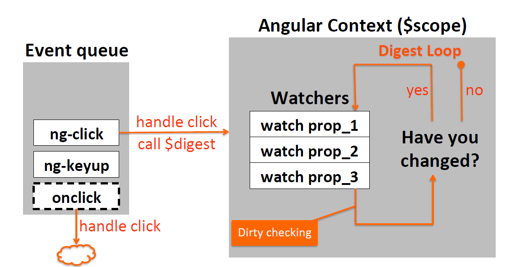

# Filter, Digest Cycle and Data Binding

---

## 1. Custom Filter

```js
var app = angular.module("mainApp", []);

app.controller("theController", theController);

/* A filter named "custom" */
app.filter("custom", function () {
    return function (input) {
        var output = doSomething(input);
        return output;
    };
});

/* Inject argument named "custom" + "Filter" */
theController.$inject = ["$scope", "customFilter"];

function theController($scope, customFilter) {
    var msg = "some input";
    /* Use customFilter(input); */
    customFilter(msg);
}

```


Add arguments to our filter:

```js
var app = angular.module("mainApp", []);

app.controller("theController", theController);

app.filter("custom", function () {
    /* Add arguments */
    return function (input, arg1) {
        var output = doSomething(input);
        return output;
    };
});

theController.$inject = ["$scope", "customFilter"];

function theController($scope, customFilter) {
    var msg = "some input";
    /* Use customFilter(input, arg1); */
    customFilter(msg, arg1);
}

```

Don't need to add "Filter" in html file

```html
{{ Hello | custom }}

{{ Hello | custom : arg1 }}

{{ Hello | custom | uppercase }}
<!-- $filter("uppercase")(customFilter("Hello")); -->
```

---

## 2. Digest Cycle

在\$scope中的变量如果在html中显示，angular为其创建watcher，负责监视它是否有变化：angular事件触发trigger，进行dirty checking，有变化则改变html中的显示，直到一次check没有任何dirty数据，则退出循环，因此这个dirty checking的循环一般持续2次。这个循环称为 Digest Cycle.




---

angular中的事件一般会触发digest cycle，如ng-click, ng-keyup，但是原生js事件则不会，我们需要**自己调用digest**。

两种方法：

 * **\$digest();** 
 * **\$apply(function () {});**

### 方法1：\$digest();

```js
/*原生JavaScript setTimeout 调用digest*/
$scope.upDelayCounter = function () {
    setTimeout(function () {
        ++$scope.delayCounter;
        $scope.$digest();
    }, 1000);
};
```

该方法无法handle异常。

### 方法2：\$apply();
```js
$scope.upDelayCounter = function () {
    setTimeout(function () {
        $scope.$apply(function () {
            ++$scope.delayCounter;
        });
    }, 1000);
};
```

推荐的写法，在没有异常时候会自动执行**\$digest()**;

### 方法3：angular事件代替

```js
/*Angular使用自己的timeout*/
$scope.upDelayCounter = function () {
    $timeout(function () {
        ++$scope.delayCounter;
    }, 1000);
};
```

---

## 3. Data Binding

### 2-way

```html
<input type="text" ng-model="someModel" />
```

### 1-way

```html
<p>Messages: {{ msg }} </p>
```

### 1-time

```html
<p>Name: {{ ::fullname }} </p>
```

1-time Binding 只在初始化时绑定并更新UI，在未初始化时，\$scope中存在变量的watcher，一旦变量初始化，会删除该变量在watchers队列中绑定的watcher。